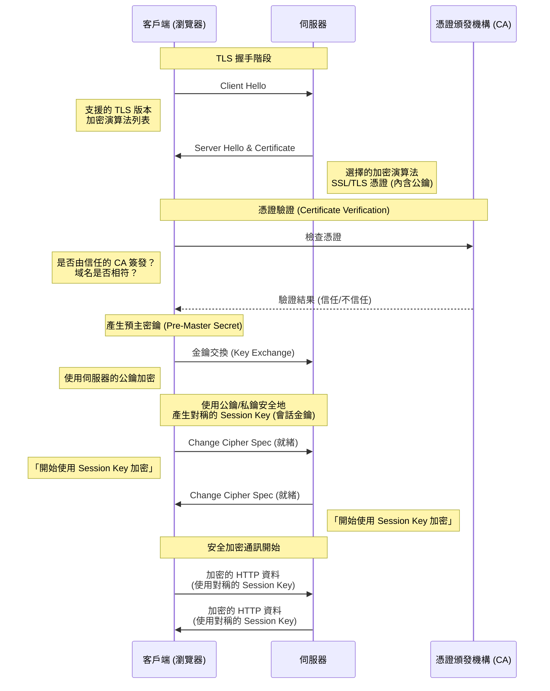
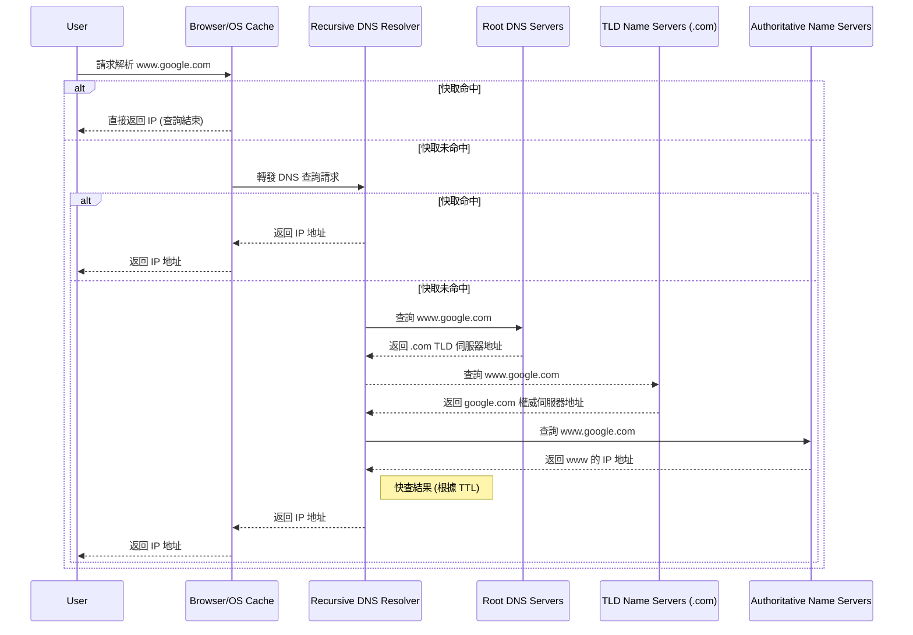
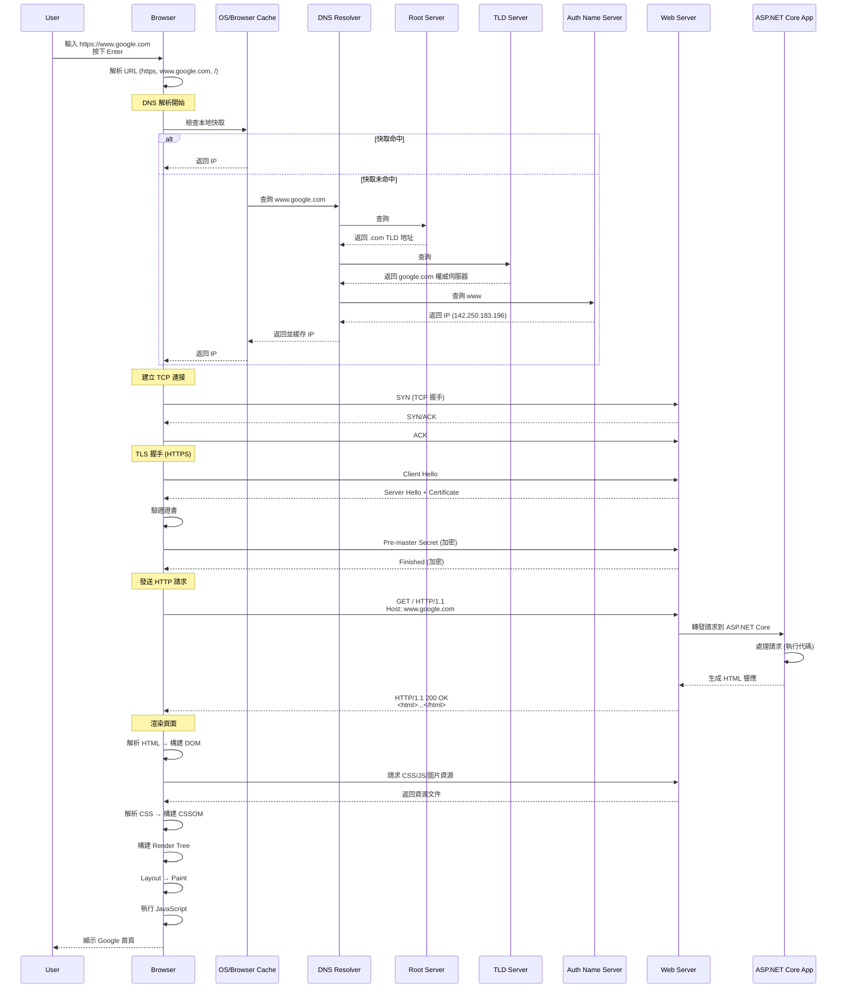

# Chapter 3.1: Web Basics - How the Internet Works

歡迎來到 ASP.NET Core！在我們深入建構 Web 應用程式之前，理解 Web 如何運作的基礎概念至關重要。這份知識將是我們後續所有建構工作的基礎。

## 1. The Client-Server Model

網際網路的核心是基於 **Client-Server Model** (主從式架構) 運作。

-   **Client (客戶端):** 這指的是使用者的設備和網頁瀏覽器（例如您筆電或手機上的 Chrome、Firefox）。Client 的工作是**請求 (request)** 資訊。
-   **Server (伺服器):** 這是一台位於世界某處的強大電腦，它**儲存 (stores)** 著網頁、網站或應用程式。Server 的工作是**監聽 (listen)** 來自客戶端的請求，並以被請求的資訊來**回應 (respond)**。

當您在瀏覽器中輸入一個 URL 時，您其實是在告訴您的 Client 向一個特定的 Server 發送請求。然後，Server 會回傳網站的資料，您的瀏覽器會將這些資料組合起來並顯示出來。


## 2. IP Addresses and DNS

但是，您的 Client 如何知道要與哪個 Server 通話呢？每個連接到網際網路的設備都有一個獨一無二的 **IP Address** (網際網路協定位址)，例如 `172.217.16.14` (這是 Google 的其中一個地址)。

要記住這些數字對人類來說是不可能的。這就是 **DNS (Domain Name System)** 發揮作用的地方。

-   **DNS 是網際網路的電話簿。**
-   當您在瀏覽器中輸入像 `www.google.com` 這樣的域名時，瀏覽器會先向 DNS 伺服器發送一個請求。
-   DNS 伺服器在其「電話簿」中查找 `www.google.com`，並找到對應的 IP Address。
-   然後它將這個 IP Address 回傳給瀏覽器。
-   現在瀏覽器有了正確的 IP Address，它就可以直接向 Google 的 Server 發送請求了。

**比喻：** 您想打電話給您的朋友 John。您不知道他的電話號碼，但您知道他的名字。您在手機的聯絡人（DNS）中查找 "John"，找到他的號碼（IP Address），然後您就可以撥打電話了。

## Summary of the process:

1.  您在瀏覽器（**Client**）中輸入 `www.example.com`。
2.  瀏覽器聯繫 **DNS Server** 以獲取 `www.example.com` 的 IP Address。
3.  DNS Server 回覆對應的 IP Address (例如 `93.184.216.34`)。
4.  瀏覽器向該 IP Address 的伺服器發送一個 HTTP request。
5.  **Server** 處理該請求，並回傳網站的檔案 (HTML, CSS, JavaScript)。
6.  您的瀏覽器接收到這些檔案，並將網頁渲染出來供您查看。

---

# Chapter 3.2: HTTP(S) Protocol

我們已經知道瀏覽器如何透過 DNS 找到伺服器的 IP 位址。現在，我們來學習它們之間溝通所使用的語言：**HTTP**。

## 1. What is HTTP?

HTTP (Hypertext Transfer Protocol) 是一套定義了 Client 和 Server 之間如何交換訊息的規則。它是一種「請求-回應」協議。

-   **Client** 發送一個 **HTTP Request** (請求) 到 Server。
-   **Server** 回傳一個 **HTTP Response** (回應) 給 Client。

這個過程是無狀態的 (Stateless)，意味著每個請求都是獨立的，Server 不會記住前一個請求的任何資訊。

## 2. Structure of an HTTP Request

一個 HTTP 請求主要由以下幾部分組成：

1.  **Method (方法):** 定義了請求的意圖。最常見的有：
    -   `GET`: 請求獲取資源 (例如：載入一個網頁)。
    -   `POST`: 提交資料到伺服器以建立新資源 (例如：送出一個註冊表單)。
    -   `PUT`: 更新伺服器上的現有資源。
    -   `DELETE`: 刪除伺服器上的資源。

2.  **URL (路徑):** 指定了請求的資源在哪裡 (例如 `/products/123`)。

3.  **Headers (標頭):** 包含關於請求的附加資訊，以 `Key: Value` 的形式存在。例如：
    -   `Host: www.example.com`
    -   `Accept: text/html`
    -   `User-Agent: Chrome/128.0...`

4.  **Body (本文):** 包含了要傳送給伺服器的資料，通常在 `POST` 或 `PUT` 請求中使用 (例如：JSON 格式的表單資料)。`GET` 請求通常沒有 Body。

## 3. Structure of an HTTP Response

伺服器回傳的 HTTP 回應包含：

1.  **Status Code (狀態碼):** 一個三位數的數字，表示請求的結果。最常見的有：
    -   `200 OK`: 請求成功。
    -   `404 Not Found`: 請求的資源不存在。
    -   `500 Internal Server Error`: 伺服器內部發生錯誤。
    -   `301 Moved Permanently`: 請求的資源已被永久移動到新的 URL。
    -   `401 Unauthorized`: 請求需要驗證。

2.  **Headers (標頭):** 包含關於回應的附加資訊。例如：
    -   `Content-Type: text/html`
    -   `Content-Length: 1234`
    -   `Date: Sun, 25 Aug 2025...`

3.  **Body (本文):** 包含了伺服器回傳的實際內容 (例如：網頁的 HTML、API 回傳的 JSON 資料)。

## 4. What is HTTPS? (Deep Dive)

您會經常看到 `https://` 而不是 `http://`。那個 **S** 代表 **Secure (安全)**，它為我們的網路通訊提供了三層關鍵保護：

-   **加密 (Encryption):** 防止竊聽。確保在 Client 和 Server 之間交換的資料是加密的，即使被攔截也無法讀取。
-   **資料完整性 (Data Integrity):** 防止竄改。確保資料在傳輸過程中沒有被修改。
-   **身分驗證 (Authentication):** 防止假冒。驗證您正在通訊的網站確實是它所聲稱的那個網站。

這一切的核心是 **TLS (Transport Layer Security)** 協議，以及它的前身 **SSL (Secure Sockets Layer)**。

### SSL vs. TLS

-   **SSL (Secure Sockets Layer):** 是最早用於加密網路通訊的協議。然而，由於發現了多個安全漏洞，所有版本的 SSL 現在都已被視為不安全並被棄用。
-   **TLS (Transport Layer Security):** 是 SSL 的現代後繼者。它更安全、更強大。當我們今天談論 SSL 時，我們通常指的是 TLS，因為 "SSL" 這個詞已經成為了一種通俗的說法。目前，TLS 1.2 和 TLS 1.3 是廣泛使用的標準。

### The TLS Handshake: 如何建立安全連線

當您的瀏覽器嘗試連接一個 `https://` 網站時，它會與伺服器進行一個稱為 **TLS Handshake (交握)** 的過程，以建立一個安全的通道。這個過程可以簡化為以下幾個步驟：

1.  **Client Hello:** 您的瀏覽器向伺服器發送一個 "Hello" 訊息。這個訊息包含了瀏覽器支援的 TLS 版本和加密演算法列表。

2.  **Server Hello & Certificate:**
    -   伺服務器回覆一個 "Hello"，並從瀏覽器提供的列表中選擇一個雙方都支援的加密演算法。
    -   最關鍵的是，伺服器會提供它的 **SSL/TLS Certificate (憑證)**。

3.  **Certificate Verification:**
    -   這個憑證就像是伺服器的數位身分證。它由一個受信任的第三方機構，稱為 **Certificate Authority (CA)** (憑證頒發機構，例如 Let's Encrypt, DigiCert) 所簽發。
    -   憑證中包含了網站的域名、擁有者、以及一個 **Public Key (公鑰)**。
    -   您的瀏覽器會檢查這個憑證是否由一個它所信任的 CA 簽發，以及憑證上的域名是否與您正在訪問的網站域名相符。這一步驟驗證了伺服器的身分，確保您沒有連到一個假冒的網站。

4.  **Key Exchange:**
    -   在驗證伺服器身分後，瀏覽器和伺服器會使用憑證中的公鑰進行一個加密的「金鑰交換」過程。
    -   這個過程的目標是安全地產生一個全新的、對稱的 **Session Key (會話金鑰)**。這個金鑰只對本次通訊有效。

5.  **Secure Communication:**
    -   一旦 TLS Handshake 完成，後續所有的 HTTP 資料都會使用這個剛剛產生的 Session Key 進行加密和解密。
    -   使用對稱金鑰 (Symmetric Key) 加密實際資料是因為它的計算效率遠高於使用非對稱金鑰 (Asymmetric Key，如公鑰/私鑰對)。

總結來說，HTTPS 透過 TLS Handshake，先用較慢但安全的非對稱加密來驗證身分並交換金鑰，然後再用高效的對稱加密來保護後續的實際通訊。

+ Sequence Diagram

---

# Chapter 3.3: How DNS Works (Deep Dive)

我們在前面將 DNS 比喻為「網際網路的電話簿」。現在，我們來深入了解這本電話簿是如何被查詢的，這個過程稱為 **Recursive DNS Query**。

## 1. The DNS Query Path

當您在瀏覽器輸入 `www.google.com` 時，完整的查詢路徑比我們之前提到的要更複雜一些，它涉及一個階層式的查詢鏈：

1.  **Browser/OS Cache:** 您的瀏覽器和作業系統會先檢查自己的快取 (Cache)。如果您最近訪問過這個網站，IP 位址可能就儲存在本機，查詢直接在這裡結束，速度最快。

2.  **Recursive DNS Server (Resolver):**
    -   如果在本機快取中找不到，請求會被發送到 **Recursive DNS Server**。這通常是您的網際網路服務供應商 (ISP) 提供的伺服器。
    -   這個 Resolver 的工作就是，即使它自己不知道答案，它也有責任去問遍整個 DNS 系統，直到找到答案為止。

3.  **Root DNS Servers (`.`):**
    -   Resolver 首先會去問 **Root Server**。全世界只有 13 組根伺服器 (雖然每組都有很多實體鏡像)。
    -   Root Server 不知道 `www.google.com` 的 IP，但它知道誰負責管理 `.com` 這個頂級域名 (Top-Level Domain, TLD)，於是它會告訴 Resolver：「我不知道，但你可以去問 `.com` 的 TLD 伺服器。」

4.  **TLD Name Servers (`.com`):**
    -   Resolver 接著去問 `.com` 的 TLD 伺服器。
    -   TLD 伺服器同樣不知道 `www.google.com` 的 IP，但它儲存了 `google.com` 這個域名的**權威名稱伺服器 (Authoritative Name Server)** 的地址。於是它告訴 Resolver：「我不知道，但你可以去問 `google.com` 自己的 Name Server。」

5.  **Authoritative Name Servers (`google.com`):**
    -   最後，Resolver 去問 `google.com` 的權威名稱伺服器。這個伺服器是由 Google 自己管理的，它對 `google.com` 網域下的所有紀錄都有最終解釋權。
    -   它在自己的紀錄中找到了 `www` 這個子網域對應的 IP 位址，並將這個最終答案回傳給 Resolver。

6.  **Response and Caching:**
    -   Resolver 拿到了 IP 位址，它會先將這個答案快取起來 (快取的時間由一個稱為 TTL (Time-To-Live) 的值決定)，然後再將 IP 位址回傳給您的瀏覽器。
    -   下次再有其他人向這個 Resolver 查詢同一個網址時，它就可以直接從快取中提供答案，不必再重複整個查詢過程。



## 2. Common DNS Record Types

一個域名的 Authoritative Name Server 不只儲存 IP 位址，它還儲存了很多不同類型的紀錄 (Record)，以下是幾種最常見的：

-   **A Record:** 將一個域名指向一個 IPv4 位址 (例如 `172.217.16.14`)。
-   **AAAA Record:** 將一個域名指向一個 IPv6 位址。
-   **CNAME Record (Canonical Name):** 將一個域名作為另一個域名的別名。例如，可以將 `ftp.example.com` 指向 `www.example.com`。
-   **MX Record (Mail Exchange):** 指定負責處理該域名電子郵件的郵件伺服器。

---

# Chapter 3.4: What Happens When You Type a URL?

這個問題是 Web 開發面試中的經典問題，因爲它完美地將我們先前學到的所有概念——DNS, HTTP(S), Client/Server——全部串連起來。讓我們來走一遍完整的旅程。

假設您在瀏覽器中輸入 `https://www.google.com` 並按下 Enter。

1.  **您按下 Enter 鍵:** 瀏覽器從 URL 中解析出協議 (`https`)、域名 (`www.google.com`) 和路徑 (此處為 `/`，即根目錄)。

2.  **DNS Lookup:**
    - 瀏覽器開始進行我們在 `Chapter 3.3` 中深入探討的 DNS 查詢，以找到 `www.google.com` 的 IP 位址。
    - 這個過程會依序檢查：瀏覽器快取 -> 作業系統快取 -> Recursive Resolver -> Root Server -> TLD Server -> Authoritative Name Server。
    - 最終，瀏覽器獲得了 `www.google.com` 的 IP 位址，例如 `142.250.183.196`。

3.  **TCP Handshake:**
    - 在發送 HTTP 請求之前，瀏覽器需要與伺服器建立一個可靠的連線。這通過 **TCP (Transmission Control Protocol)** 的「三向交握 (Three-way Handshake)」來完成。
    - **Client -> Server:** `SYN` (我想與你建立連線)
    - **Server -> Client:** `SYN/ACK` (好的，我同意，你也準備好了嗎？)
    - **Client -> Server:** `ACK` (是的，我準備好了！)
    - 至此，一個穩定的 TCP 連線就建立好了。

4.  **TLS Handshake:**
    - 因為我們使用的是 `https`，所以現在需要在已建立的 TCP 連線之上，進行 `Chapter 3.2` 中描述的 TLS Handshake。
    - 這個過程會驗證伺服器的身份 (透過 SSL/TLS 憑證)，並協商出一個對稱的 Session Key，用於加密後續的所有通訊。

5.  **HTTP Request:**
    - 現在，安全通道已建立，瀏覽器終於可以發送 HTTP 請求了。
    - 請求的內容可能像這樣：
      ```http
      GET / HTTP/1.1
      Host: www.google.com
      User-Agent: Mozilla/5.0 (Windows NT 10.0; Win64; x64) ...
      Accept: text/html,...
      ```

6.  **Server Processing:**
    - Google 的伺服器接收到這個請求。
    - Web Server (例如 Nginx, Apache) 將請求轉發給後端應用程式處理。
    - **這就是 ASP.NET Core 發揮作用的地方！** 您的後端程式碼會執行，根據請求的路徑 (`/`) 和方法 (`GET`) 來決定要做什麼。在這個例子中，它會準備 Google 首頁的 HTML 內容。

7.  **HTTP Response:**
    - 伺服器將準備好的 HTML 內容打包成一個 HTTP 回應，發送回瀏覽器。
    - 回應的內容可能像這樣：
      ```http
      HTTP/1.1 200 OK
      Content-Type: text/html; charset=UTF-8
      Content-Length: 15926
      ...

      <!doctype html><html>...</html>
      ```

8.  **Browser Rendering:**
    - 瀏覽器接收到回應後，開始解析和渲染頁面。
    - **Parse HTML:** 瀏覽器讀取 HTML，並建立一個 **DOM (Document Object Model)** 樹狀結構。
    - **Fetch Additional Resources:** 在解析 HTML 的過程中，如果遇到 `<link rel="stylesheet" href="style.css">` 或 `<script src="main.js">` 或 `` 等標籤，瀏覽器會為這些檔案發起新的 HTTP 請求去下載它們。這些請求可能會重複使用現有的 TCP 連線以提高效率。
    - **Construct Render Tree:** 瀏覽器解析 CSS 並建立 **CSSOM (CSS Object Model)**。然後將 DOM 和 CSSOM 結合起來，建立 **Render Tree**。
    - **Layout & Paint:** 瀏覽器根據 Render Tree 計算出每個元素在螢幕上的確切位置和大小 (Layout)，然後將它們實際繪製到螢幕上 (Paint)。
    - **Execute JavaScript:** JavaScript 程式碼會被執行，它可能會修改 DOM 或 CSSOM，這可能會觸發頁面的重新佈局 (Re-layout) 和重繪 (Re-paint)。

至此，您終於看到了 Google 的首頁！



---

恭喜！您已經完成了 `Web Basics` 的所有學習。這些是理解所有現代 Web 框架 (包括 ASP.NET Core) 的基石。

如果都理解了，請告訴我，我將為您更新 `README.md` 的進度，然後我們就可以正式進入 **ASP.NET Core Fundamentals** 的學習！
