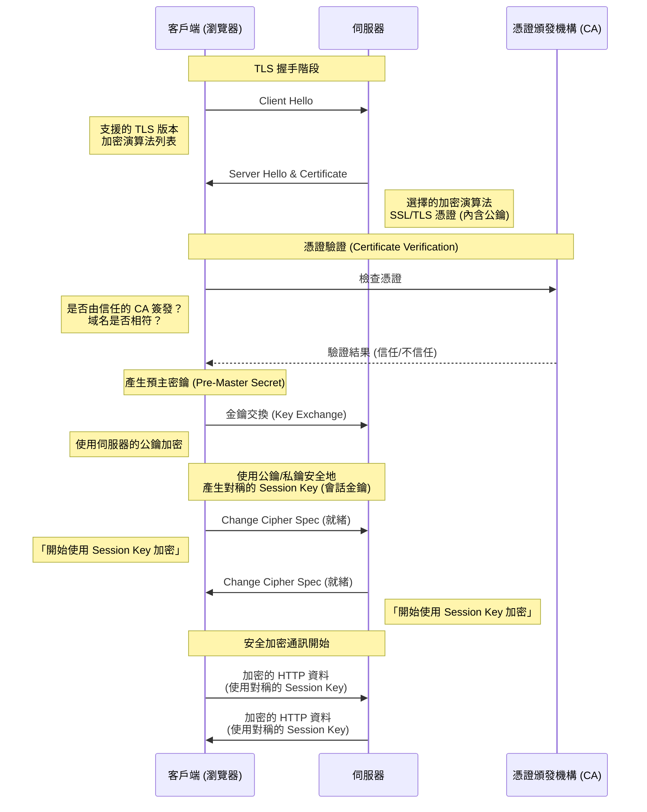
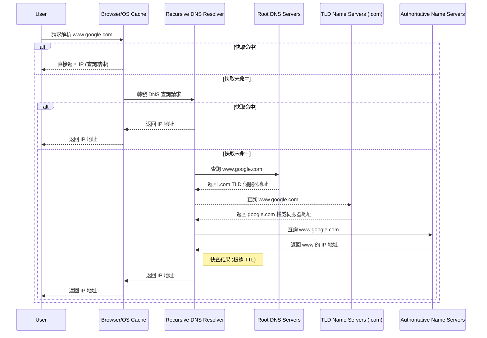
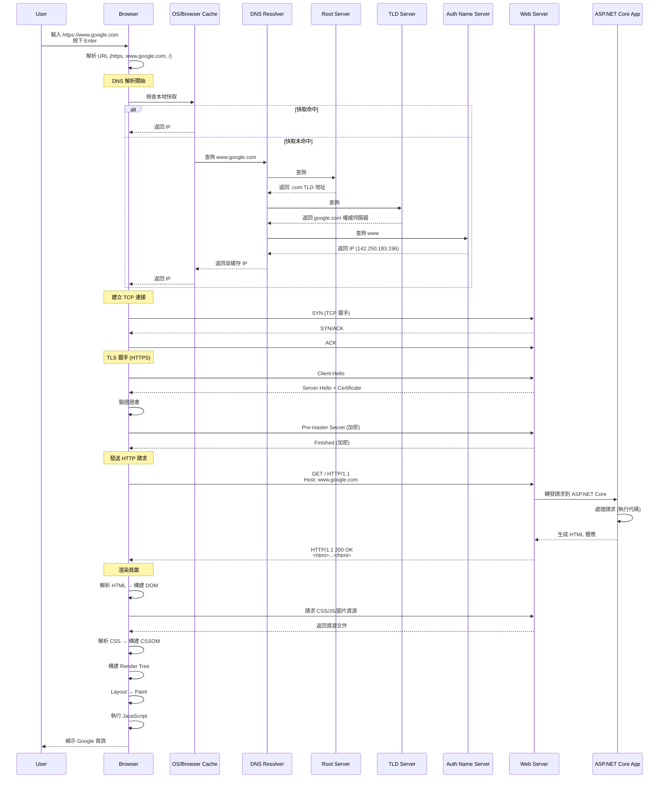
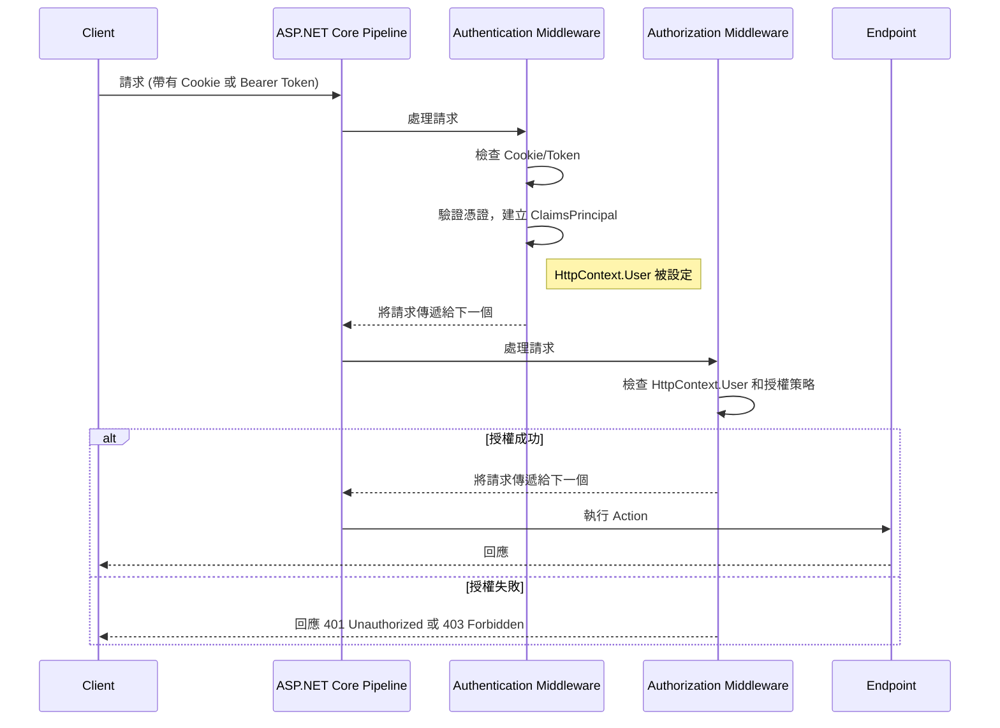
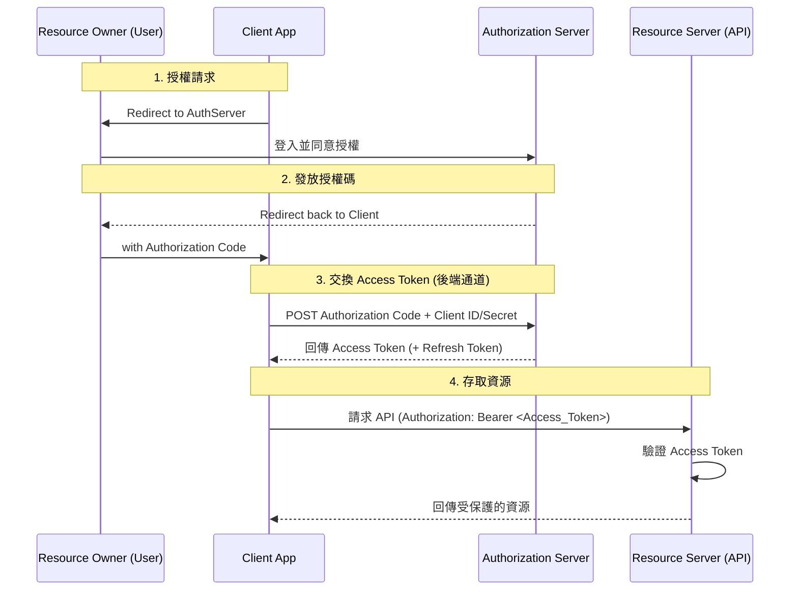

# Chapter 3.1: Web Basics - How the Internet Works

歡迎來到 ASP.NET Core！在我們深入建構 Web 應用程式之前，理解 Web 如何運作的基礎概念至關重要。這份知識將是我們後續所有建構工作的基礎。

## 1. The Client-Server Model

網際網路的核心是基於 **Client-Server Model** (主從式架構) 運作。

-   **Client (客戶端):** 這指的是使用者的設備和網頁瀏覽器（例如您筆電或手機上的 Chrome、Firefox）。Client 的工作是**請求 (request)** 資訊。
-   **Server (伺服器):** 這是一台位於世界某處的強大電腦，它**儲存 (stores)** 著網頁、網站或應用程式。Server 的工作是**監聽 (listen)** 來自客戶端的請求，並以被請求的資訊來**回應 (respond)**。

當您在瀏覽器中輸入一個 URL 時，您其實是在告訴您的 Client 向一個特定的 Server 發送請求。然後，Server 會回傳網站的資料，您的瀏覽器會將這些資料組合起來並顯示出來。


## 2. IP Addresses and DNS

但是，您的 Client 如何知道要與哪個 Server 通話呢？每個連接到網際網路的設備都有一個獨一無二的 **IP Address** (網際網路協定位址)，例如 `172.217.16.14` (這是 Google 的其中一個地址)。

要記住這些數字對人類來說是不可能的。這就是 **DNS (Domain Name System)** 發揮作用的地方。

-   **DNS 是網際網路的電話簿。**
-   當您在瀏覽器中輸入像 `www.google.com` 這樣的域名時，瀏覽器會先向 DNS 伺服器發送一個請求。
-   DNS 伺服器在其「電話簿」中查找 `www.google.com`，並找到對應的 IP Address。
-   然後它將這個 IP Address 回傳給瀏覽器。
-   現在瀏覽器有了正確的 IP Address，它就可以直接向 Google 的 Server 發送請求了。

**比喻：** 您想打電話給您的朋友 John。您不知道他的電話號碼，但您知道他的名字。您在手機的聯絡人（DNS）中查找 "John"，找到他的號碼（IP Address），然後您就可以撥打電話了。

## Summary of the process:

1.  您在瀏覽器（**Client**）中輸入 `www.example.com`。
2.  瀏覽器聯繫 **DNS Server** 以獲取 `www.example.com` 的 IP Address。
3.  DNS Server 回覆對應的 IP Address (例如 `93.184.216.34`)。
4.  瀏覽器向該 IP Address 的伺服器發送一個 HTTP request。
5.  **Server** 處理該請求，並回傳網站的檔案 (HTML, CSS, JavaScript)。
6.  您的瀏覽器接收到這些檔案，並將網頁渲染出來供您查看。

---

# Chapter 3.2: HTTP(S) Protocol

我們已經知道瀏覽器如何透過 DNS 找到伺服器的 IP 位址。現在，我們來學習它們之間溝通所使用的語言：**HTTP**。

## 1. What is HTTP?

HTTP (Hypertext Transfer Protocol) 是一套定義了 Client 和 Server 之間如何交換訊息的規則。它是一種「請求-回應」協議。

-   **Client** 發送一個 **HTTP Request** (請求) 到 Server。
-   **Server** 回傳一個 **HTTP Response** (回應) 給 Client。

這個過程是無狀態的 (Stateless)，意味著每個請求都是獨立的，Server 不會記住前一個請求的任何資訊。

## 2. Structure of an HTTP Request

一個 HTTP 請求主要由以下幾部分組成：

1.  **Method (方法):** 定義了請求的意圖。最常見的有：
    -   `GET`: 請求獲取資源 (例如：載入一個網頁)。
    -   `POST`: 提交資料到伺服器以建立新資源 (例如：送出一個註冊表單)。
    -   `PUT`: 更新伺服器上的現有資源。
    -   `DELETE`: 刪除伺服器上的資源。

2.  **URL (路徑):** 指定了請求的資源在哪裡 (例如 `/products/123`)。

3.  **Headers (標頭):** 包含關於請求的附加資訊，以 `Key: Value` 的形式存在。例如：
    -   `Host: www.example.com`
    -   `Accept: text/html`
    -   `User-Agent: Chrome/128.0...`

4.  **Body (本文):** 包含了要傳送給伺服器的資料，通常在 `POST` 或 `PUT` 請求中使用 (例如：JSON 格式的表單資料)。`GET` 請求通常沒有 Body。

## 3. Structure of an HTTP Response

伺服器回傳的 HTTP 回應包含：

1.  **Status Code (狀態碼):** 一個三位數的數字，表示請求的結果。最常見的有：
    -   `200 OK`: 請求成功。
    -   `404 Not Found`: 請求的資源不存在。
    -   `500 Internal Server Error`: 伺服器內部發生錯誤。
    -   `301 Moved Permanently`: 請求的資源已被永久移動到新的 URL。
    -   `401 Unauthorized`: 請求需要驗證。

2.  **Headers (標頭):** 包含關於回應的附加資訊。例如：
    -   `Content-Type: text/html`
    -   `Content-Length: 1234`
    -   `Date: Sun, 25 Aug 2025...`

3.  **Body (本文):** 包含了伺服器回傳的實際內容 (例如：網頁的 HTML、API 回傳的 JSON 資料)。

## 4. What is HTTPS? (Deep Dive)

您會經常看到 `https://` 而不是 `http://`。那個 **S** 代表 **Secure (安全)**，它為我們的網路通訊提供了三層關鍵保護：

-   **加密 (Encryption):** 防止竊聽。確保在 Client 和 Server 之間交換的資料是加密的，即使被攔截也無法讀取。
-   **資料完整性 (Data Integrity):** 防止竄改。確保資料在傳輸過程中沒有被修改。
-   **身分驗證 (Authentication):** 防止假冒。驗證您正在通訊的網站確實是它所聲稱的那個網站。

這一切的核心是 **TLS (Transport Layer Security)** 協議，以及它的前身 **SSL (Secure Sockets Layer)**。

### SSL vs. TLS

-   **SSL (Secure Sockets Layer):** 是最早用於加密網路通訊的協議。然而，由於發現了多個安全漏洞，所有版本的 SSL 現在都已被視為不安全並被棄用。
-   **TLS (Transport Layer Security):** 是 SSL 的現代後繼者。它更安全、更強大。當我們今天談論 SSL 時，我們通常指的是 TLS，因為 "SSL" 這個詞已經成為了一種通俗的說法。目前，TLS 1.2 和 TLS 1.3 是廣泛使用的標準。

### The TLS Handshake: 如何建立安全連線

當您的瀏覽器嘗試連接一個 `https://` 網站時，它會與伺服器進行一個稱為 **TLS Handshake (交握)** 的過程，以建立一個安全的通道。這個過程可以簡化為以下幾個步驟：

1.  **Client Hello:** 您的瀏覽器向伺服器發送一個 "Hello" 訊息。這個訊息包含了瀏覽器支援的 TLS 版本和加密演算法列表。

2.  **Server Hello & Certificate:**
    -   伺服務器回覆一個 "Hello"，並從瀏覽器提供的列表中選擇一個雙方都支援的加密演算法。
    -   最關鍵的是，伺服器會提供它的 **SSL/TLS Certificate (憑證)**。

3.  **Certificate Verification:**
    -   這個憑證就像是伺服器的數位身分證。它由一個受信任的第三方機構，稱為 **Certificate Authority (CA)** (憑證頒發機構，例如 Let's Encrypt, DigiCert) 所簽發。
    -   憑證中包含了網站的域名、擁有者、以及一個 **Public Key (公鑰)**。
    -   您的瀏覽器會檢查這個憑證是否由一個它所信任的 CA 簽發，以及憑證上的域名是否與您正在訪問的網站域名相符。這一步驟驗證了伺服器的身分，確保您沒有連到一個假冒的網站。

4.  **Key Exchange:**
    -   在驗證伺服器身分後，瀏覽器和伺服器會使用憑證中的公鑰進行一個加密的「金鑰交換」過程。
    -   這個過程的目標是安全地產生一個全新的、對稱的 **Session Key (會話金鑰)**。這個金鑰只對本次通訊有效。

5.  **Secure Communication:**
    -   一旦 TLS Handshake 完成，後續所有的 HTTP 資料都會使用這個剛剛產生的 Session Key 進行加密和解密。
    -   使用對稱金鑰 (Symmetric Key) 加密實際資料是因為它的計算效率遠高於使用非對稱金鑰 (Asymmetric Key，如公鑰/私鑰對)。

總結來說，HTTPS 透過 TLS Handshake，先用較慢但安全的非對稱加密來驗證身分並交換金鑰，然後再用高效的對稱加密來保護後續的實際通訊。

+ Sequence Diagram

---

# Chapter 3.3: How DNS Works (Deep Dive)

我們在前面將 DNS 比喻為「網際網路的電話簿」。現在，我們來深入了解這本電話簿是如何被查詢的，這個過程稱為 **Recursive DNS Query**。

## 1. The DNS Query Path

當您在瀏覽器輸入 `www.google.com` 時，完整的查詢路徑比我們之前提到的要更複雜一些，它涉及一個階層式的查詢鏈：

1.  **Browser/OS Cache:** 您的瀏覽器和作業系統會先檢查自己的快取 (Cache)。如果您最近訪問過這個網站，IP 位址可能就儲存在本機，查詢直接在這裡結束，速度最快。

2.  **Recursive DNS Server (Resolver):**
    -   如果在本機快取中找不到，請求會被發送到 **Recursive DNS Server**。這通常是您的網際網路服務供應商 (ISP) 提供的伺服器。
    -   這個 Resolver 的工作就是，即使它自己不知道答案，它也有責任去問遍整個 DNS 系統，直到找到答案為止。

3.  **Root DNS Servers (`.`):**
    -   Resolver 首先會去問 **Root Server**。全世界只有 13 組根伺服器 (雖然每組都有很多實體鏡像)。
    -   Root Server 不知道 `www.google.com` 的 IP，但它知道誰負責管理 `.com` 這個頂級域名 (Top-Level Domain, TLD)，於是它會告訴 Resolver：「我不知道，但你可以去問 `.com` 的 TLD 伺服器。」

4.  **TLD Name Servers (`.com`):**
    -   Resolver 接著去問 `.com` 的 TLD 伺服器。
    -   TLD 伺服器同樣不知道 `www.google.com` 的 IP，但它儲存了 `google.com` 這個域名的**權威名稱伺服器 (Authoritative Name Server)** 的地址。於是它告訴 Resolver：「我不知道，但你可以去問 `google.com` 自己的 Name Server。」

5.  **Authoritative Name Servers (`google.com`):**
    -   最後，Resolver 去問 `google.com` 的權威名稱伺服器。這個伺服器是由 Google 自己管理的，它對 `google.com` 網域下的所有紀錄都有最終解釋權。
    -   它在自己的紀錄中找到了 `www` 這個子網域對應的 IP 位址，並將這個最終答案回傳給 Resolver。

6.  **Response and Caching:**
    -   Resolver 拿到了 IP 位址，它會先將這個答案快取起來 (快取的時間由一個稱為 TTL (Time-To-Live) 的值決定)，然後再將 IP 位址回傳給您的瀏覽器。
    -   下次再有其他人向這個 Resolver 查詢同一個網址時，它就可以直接從快取中提供答案，不必再重複整個查詢過程。



## 2. Common DNS Record Types

一個域名的 Authoritative Name Server 不只儲存 IP 位址，它還儲存了很多不同類型的紀錄 (Record)，以下是幾種最常見的：

-   **A Record:** 將一個域名指向一個 IPv4 位址 (例如 `172.217.16.14`)。
-   **AAAA Record:** 將一個域名指向一個 IPv6 位址。
-   **CNAME Record (Canonical Name):** 將一個域名作為另一個域名的別名。例如，可以將 `ftp.example.com` 指向 `www.example.com`。
-   **MX Record (Mail Exchange):** 指定負責處理該域名電子郵件的郵件伺服器。

---

# Chapter 3.4: What Happens When You Type a URL?

這個問題是 Web 開發面試中的經典問題，因爲它完美地將我們先前學到的所有概念——DNS, HTTP(S), Client/Server——全部串連起來。讓我們來走一遍完整的旅程。

假設您在瀏覽器中輸入 `https://www.google.com` 並按下 Enter。

1.  **您按下 Enter 鍵:** 瀏覽器從 URL 中解析出協議 (`https`)、域名 (`www.google.com`) 和路徑 (此處為 `/`，即根目錄)。

2.  **DNS Lookup:**
    - 瀏覽器開始進行我們在 `Chapter 3.3` 中深入探討的 DNS 查詢，以找到 `www.google.com` 的 IP 位址。
    - 這個過程會依序檢查：瀏覽器快取 -> 作業系統快取 -> Recursive Resolver -> Root Server -> TLD Server -> Authoritative Name Server。
    - 最終，瀏覽器獲得了 `www.google.com` 的 IP 位址，例如 `142.250.183.196`。

3.  **TCP Handshake:**
    - 在發送 HTTP 請求之前，瀏覽器需要與伺服器建立一個可靠的連線。這通過 **TCP (Transmission Control Protocol)** 的「三向交握 (Three-way Handshake)」來完成。
    - **Client -> Server:** `SYN` (我想與你建立連線)
    - **Server -> Client:** `SYN/ACK` (好的，我同意，你也準備好了嗎？)
    - **Client -> Server:** `ACK` (是的，我準備好了！)
    - 至此，一個穩定的 TCP 連線就建立好了。

4.  **TLS Handshake:**
    - 因為我們使用的是 `https`，所以現在需要在已建立的 TCP 連線之上，進行 `Chapter 3.2` 中描述的 TLS Handshake。
    - 這個過程會驗證伺服器的身份 (透過 SSL/TLS 憑證)，並協商出一個對稱的 Session Key，用於加密後續的所有通訊。

5.  **HTTP Request:**
    - 現在，安全通道已建立，瀏覽器終於可以發送 HTTP 請求了。
    - 請求的內容可能像這樣：
      ```http
      GET / HTTP/1.1
      Host: www.google.com
      User-Agent: Mozilla/5.0 (Windows NT 10.0; Win64; x64) ...
      Accept: text/html,...
      ```

6.  **Server Processing:**
    - Google 的伺服器接收到這個請求。
    - Web Server (例如 Nginx, Apache) 將請求轉發給後端應用程式處理。
    - **這就是 ASP.NET Core 發揮作用的地方！** 您的後端程式碼會執行，根據請求的路徑 (`/`) 和方法 (`GET`) 來決定要做什麼。在這個例子中，它會準備 Google 首頁的 HTML 內容。

7.  **HTTP Response:**
    - 伺服器將準備好的 HTML 內容打包成一個 HTTP 回應，發送回瀏覽器。
    - 回應的內容可能像這樣：
      ```http
      HTTP/1.1 200 OK
      Content-Type: text/html; charset=UTF-8
      Content-Length: 15926
      ...

      <!doctype html><html>...</html>
      ```

8.  **Browser Rendering:**
    - 瀏覽器接收到回應後，開始解析和渲染頁面。
    - **Parse HTML:** 瀏覽器讀取 HTML，並建立一個 **DOM (Document Object Model)** 樹狀結構。
    - **Fetch Additional Resources:** 在解析 HTML 的過程中，如果遇到 `<link rel="stylesheet" href="style.css">` 或 `<script src="main.js">` 或 `` 等標籤，瀏覽器會為這些檔案發起新的 HTTP 請求去下載它們。這些請求可能會重複使用現有的 TCP 連線以提高效率。
    - **Construct Render Tree:** 瀏覽器解析 CSS 並建立 **CSSOM (CSS Object Model)**。然後將 DOM 和 CSSOM 結合起來，建立 **Render Tree**。
    - **Layout & Paint:** 瀏覽器根據 Render Tree 計算出每個元素在螢幕上的確切位置和大小 (Layout)，然後將它們實際繪製到螢幕上 (Paint)。
    - **Execute JavaScript:** JavaScript 程式碼會被執行，它可能會修改 DOM 或 CSSOM，這可能會觸發頁面的重新佈局 (Re-layout) 和重繪 (Re-paint)。

至此，您終於看到了 Google 的首頁！



---

恭喜！您已經完成了 `Web Basics` 的所有學習。這些是理解所有現代 Web 框架 (包括 ASP.NET Core) 的基石。

如果都理解了，請告訴我，我將為您更新 `README.md` 的進度，然後我們就可以正式進入 **ASP.NET Core Fundamentals** 的學習！

---
# Chapter 3.5: ASP.NET Core Fundamentals

## 前言

歡迎來到 ASP.NET Core 的世界！這是微軟推出的高效能、跨平台的開源 Web 框架。在本章節中，我們將深入了解 ASP.NET Core 的核心概念，為後續的 Web 開發打下堅實的基礎。

## 核心概念 (Core Concepts)

### 1. Kestrel Web Server

- **Kestrel** 是 ASP.NET Core 預設的跨平台 Web Server。它速度極快，但通常會搭配反向代理伺服器 (Reverse Proxy Server) 如 IIS、Nginx 或 Apache 一起使用，以獲得更強大的功能 (例如負載平衡、SSL 終止等)。

### 2. 啟動與設定 (Startup & Configuration)

- **`Program.cs`**: 在最新的 .NET 版本中，`Program.cs` 是應用程式的進入點。這裡會設定 Web Host、註冊服務 (Services) 以及定義請求處理管線 (Request Pipeline)。
- **`appsettings.json`**: 這是主要的設定檔，用來存放應用程式的設定，例如資料庫連接字串、API 金鑰等。它可以根據不同的環境 (如 `Development`, `Production`) 有不同的版本。

### 3. 中介軟體 (Middleware)

- **Middleware** 是構成 ASP.NET Core 應用程式請求處理管線 (Request Pipeline) 的元件。每個請求都會依序通過這些中介軟體，每個中介軟體都可以對請求進行處理，然後決定是否要將請求傳遞給下一個中介軟體。
- **順序很重要**: 中介軟體的註冊順序決定了它們在請求處理中的執行順序。例如，`UseAuthentication` (驗證) 必須在 `UseAuthorization` (授權) 之前。
- **常見的中介軟體**:
    - `UseExceptionHandler()`: 例外處理，通常在最外層。
    - `UseHttpsRedirection()`: https 重向導向。
    - `UseRouting()`: 啟用路由功能。
    - `UseEndpoints()`: 定義路由的終點 (Endpoints)，例如 MVC Controllers 或 Minimal API。
    - `UseStaticFiles()`: 讓應用程式可以提供靜態檔案 (如 HTML, CSS, JavaScript)。
    - `UseAuthentication()`: 啟用驗證。
    - `UseAuthorization()`: 啟用授權。

### 4. 依賴注入 (Dependency Injection - DI)

- ASP.NET Core 內建了強大的 DI 容器。DI 是一種設計模式，可以實現「控制反轉」(Inversion of Control - IoC)，讓類別的依賴關係從內部建立改為由外部容器提供。
- **優點**:
    - **鬆散耦合 (Loose Coupling)**: 減少了類別之間的依賴性。
    - **可測試性 (Testability)**: 更容易對元件進行單元測試。
    - **可維護性 (Maintainability)**: 程式碼結構更清晰。
- **生命週期 (Service Lifetimes)**:
    - **Transient**: 每次請求時都會建立一個新的實例。
    - **Scoped**: 在同一個 HTTP 請求中，只會建立一個實例。
    - **Singleton**: 在整個應用程式生命週期中，只會建立一個實例。

### 5. 路由 (Routing)

- **Routing** 負責將传入的 HTTP 請求對應到特定的處理程式 (Handler)，例如 Controller 的 Action 或 Minimal API 的委派。
- **種類**:
    - **約定式路由 (Convention-based Routing)**: 通常用於 MVC，定義一個 URL 範本。
    - **屬性路由 (Attribute-based Routing)**: 將路由直接定義在 Controller 或 Action 上方，更具彈性，是 Web API 的首選。

## 實作練習 (Hands-on Practice)

現在，讓我們建立一個最基本的 ASP.NET Core Web API 專案來體驗一下。

1.  **建立專案**:
    ```bash
    dotnet new webapi -n MyFirstApi -o MyFirstApi
    cd MyFirstApi
    ```

2.  **觀察 `Program.cs`**:
    打開 `Program.cs`，你會看到類似以下的程式碼：

    ```csharp
    var builder = WebApplication.CreateBuilder(args);

    // Add services to the container.
    builder.Services.AddControllers();
    builder.Services.AddEndpointsApiExplorer();
    builder.Services.AddSwaggerGen();

    var app = builder.Build();

    // Configure the HTTP request pipeline.
    if (app.Environment.IsDevelopment())
    {
        app.UseSwagger();
        app.UseSwaggerUI();
    }

    app.UseHttpsRedirection();
    app.UseAuthorization();
    app.MapControllers();

    app.Run();
    ```
    - `WebApplication.CreateBuilder(args)`: 設定應用程式的基礎。
    - `builder.Services...`: 這是 DI 容器，用來註冊服務。
    - `app.Build()`: 建立 Web 應用程式。
    - `app.Use...`: 這些是設定中介軟體。
    - `app.Run()`: 啟動應用程式。

3.  **執行專案**:
    ```bash
    dotnet run
    ```

4.  **測試 API**:
    - 打開瀏覽器，前往 `https://localhost:<port>/swagger` (port 號碼可以在 `Properties/launchSettings.json` 中找到)。
    - 你會看到 Swagger UI，這是一個自動產生的 API 文件頁面。
    - 嘗試執行預設的 `WeatherForecast` API。

## 結語

你已經完成了 ASP.NET Core 基礎的初步探索！了解 Kestrel、中介軟體、DI 和路由是掌握此框架的關鍵。

下一步，我們將深入探討 **ASP.NET MVC**，這是一個建立在 ASP.NET Core 之上的強大模式，用於開發 Web 應用程式。

---

# Chapter 3.6: ASP.NET MVC

## 前言

在了解了 ASP.NET Core 的基礎之後，我們來學習一個建立在其之上的重要開發模式：**Model-View-Controller (MVC)**。MVC 是一種廣泛應用於 Web 開發的設計模式，它將應用程式的關注點分離，使程式碼更有組織、更易於維護。

## MVC 模式的核心元件

MVC 將應用程式分為三個主要部分：

1.  **Model (模型)**:
    - **職責**: 代表應用程式的資料和業務邏輯。它負責處理資料的存取、驗證和操作。
    - **特點**: Model 不關心資料如何被呈現，它只專注於資料本身。在 ASP.NET Core 中，這通常是簡單的 C# 類別 (POCOs - Plain Old CLR Objects)。

2.  **View (視圖)**:
    - **職責**: 負責呈現資料給使用者，也就是使用者介面 (UI)。它從 Model 中取得資料並將其顯示出來。
    - **特點**: View 只負責顯示，不包含任何業務邏輯。在 ASP.NET Core 中，View 通常是使用 Razor 語法編寫的 `.cshtml` 檔案。

3.  **Controller (控制器)**:
    - **職責**: 作為 Model 和 View 之間的橋樑。它接收使用者的輸入 (HTTP 請求)，調用 Model 處理業務邏輯，然後選擇一個 View 來呈現結果。
    - **特點**: Controller 是整個請求處理流程的大腦，它協調 Model 和 View 的工作。

### 請求生命週期 (Request Lifecycle in MVC)

1.  請求進入 ASP.NET Core 的路由系統。
2.  路由系統根據 URL 將請求轉發給指定的 Controller 中的特定 Action 方法。
3.  Action 方法處理請求。它可能會：
    - 與 Model 互動，讀取或更新資料。
    - 將資料打包傳遞給 View。
4.  Action 方法選擇並回傳一個 ViewResult，指定要使用哪個 View。
5.  View 引擎 (通常是 Razor) 轉譯 View，將 Model 的資料填入 HTML 範本中。
6.  最終生成的 HTML 作為 HTTP 回應傳回給瀏覽器。

## 實作練習 (Hands-on Practice)

現在，讓我們建立一個 ASP.NET Core MVC 專案。

1.  **建立專案**:
    (請確保你在 `03-Asp-Dotnet-Core` 目錄下執行)
    ```bash
    dotnet new mvc -n MyMvcApp -o 3.6-Mvc/MyMvcApp
    cd 3.6-Mvc/MyMvcApp
    ```

2.  **觀察專案結構**:
    - **`Controllers/`**: 存放 Controller 類別。你會看到一個 `HomeController.cs`。
    - **`Models/`**: 存放 Model 類別。你會看到一個 `ErrorViewModel.cs`。
    - **`Views/`**: 存放 View 檔案 (`.cshtml`)。
        - **`Home/`**: 對應 `HomeController` 的 View。
        - **`Shared/`**: 可以被多個 View 共用的版面配置檔案 (`_Layout.cshtml`)。
    - **`wwwroot/`**: 存放靜態檔案，如 CSS, JavaScript, 圖片。

3.  **分析程式碼**:
    - **`Controllers/HomeController.cs`**:
      ```csharp
      public class HomeController : Controller
      {
          public IActionResult Index()
          {
              return View(); // 這會回傳 Views/Home/Index.cshtml
          }
      }
      ```
    - **`Views/Home/Index.cshtml`**:
      這是一個 Razor 檔案，混合了 HTML 和 C# 程式碼，用來產生最終的網頁。

4.  **執行專案**:
    ```bash
    dotnet run
    ```
    打開瀏覽器，前往 `https://localhost:<port>`，你將會看到由 `HomeController` 的 `Index` Action 和 `Index.cshtml` View 所呈現的預設首頁。

## 結語

你已經成功建立了第一個 ASP.NET Core MVC 應用程式！MVC 模式透過分離關注點，為開發複雜的 Web 應用程式提供了一個清晰、有條理的結構。

下一步，我們將探討 **Filters & Attributes**，這是在 MVC Action 執行前後添加額外邏輯的強大工具。

---

# Chapter 3.7: Filters & Attributes

## 前言

在 ASP.NET Core MVC 中，我們經常需要在 Action 方法執行之前或之後執行一些共通的邏輯，例如權限檢查、日誌記錄、異常處理等。**Filters (篩選器)** 提供了一個優雅的解決方案，讓我們可以將這些橫切關注點 (Cross-cutting Concerns) 從 Action 方法中分離出來，保持 Controller 的簡潔。

Filters 通常是透過 **Attributes (屬性)** 應用到 Controller 或 Action 上的。

## Filters 的類型與執行順序

ASP.NET Core 提供了五種類型的 Filters，它們在請求處理管線中有固定的執行順序：

1.  **Authorization Filters (授權篩選器)**
    - **用途**: 用於判斷使用者是否有權限執行某個請求。如果授權失敗，它會直接中斷後續的管線。
    - **範例**: `[Authorize]`

2.  **Resource Filters (資源篩選器)**
    - **用途**: 在模型綁定 (Model Binding) 之前執行。適合用來實現快取或處理特定內容類型的請求。
    - **介面**: `IResourceFilter`, `IAsyncResourceFilter`

3.  **Action Filters (動作篩選器)**
    - **用途**: 在 Action 方法執行 *前後* 執行程式碼。可以用來修改傳入 Action 的參數或傳出的結果。這是最常用的一種 Filter。
    - **介面**: `IActionFilter`, `IAsyncActionFilter`

4.  **Exception Filters (異常篩選器)**
    - **用途**: 當 Controller 或 Action 中發生未處理的異常時，用來進行全域的異常處理。
    - **介面**: `IExceptionFilter`, `IAsyncExceptionFilter`

5.  **Result Filters (結果篩選器)**
    - **用途**: 在 Action 結果 (例如 View 或 JSON) 執行 *前後* 執行程式碼。可以用來修改 HTTP 回應，例如加上特定的 Header。
    - **介面**: `IResultFilter`, `IAsyncResultFilter`

**執行順序圖:**
`Request -> Authorization -> Resource -> Model Binding -> Action -> Result -> Response`
(Exception Filters 只在發生錯誤時觸發)

## 實作練習 (Hands-on Practice)

讓我們來建立一個自訂的 Action Filter，用來記錄每個 Action 的執行時間。

1.  **沿用上個專案**:
    請繼續使用我們在 `3.6` 中建立的 `MyMvcApp` 專案。

2.  **建立 Filter**:
    在專案根目錄下建立一個新的資料夾 `Filters`。然後在其中新增一個 `LogActionTimeFilter.cs` 檔案：

    ```csharp
    using System.Diagnostics;
    using Microsoft.AspNetCore.Mvc.Filters;

    namespace MyMvcApp.Filters
    {
        public class LogActionTimeFilter : IActionFilter
        {
            private Stopwatch _stopwatch;

            // Action 執行前
            public void OnActionExecuting(ActionExecutingContext context)
            {
                _stopwatch = Stopwatch.StartNew();
            }

            // Action 執行後
            public void OnActionExecuted(ActionExecutedContext context)
            {
                _stopwatch.Stop();
                var elapsedTime = _stopwatch.ElapsedMilliseconds;
                var controllerName = context.Controller.GetType().Name;
                var actionName = context.ActionDescriptor.DisplayName;

                // 為了方便觀察，我們直接寫入 Console
                // 實務上應該使用 ILogger
                Console.WriteLine($"[{controllerName}] Action '{actionName}' executed in {elapsedTime}ms.");
            }
        }
    }
    ```

3.  **註冊 Filter**:
    有兩種方式可以套用 Filter：

    **a) 作為 Attribute 套用 (最常見)**
    修改 `Controllers/HomeController.cs`，將我們的 Filter 作為 Attribute 加到 `Index` Action 上：

    ```csharp
    using Microsoft.AspNetCore.Mvc;
    using MyMvcApp.Filters; // 記得 using

    namespace MyMvcApp.Controllers
    {
        public class HomeController : Controller
        {
            [ServiceFilter(typeof(LogActionTimeFilter))] // 使用 ServiceFilter 來啟用 DI
            public IActionResult Index()
            {
                return View();
            }
            // ... 其他 Action
        }
    }
    ```
    *為了讓 `[ServiceFilter]` 正常運作，我們還需要在 `Program.cs` 中註冊這個 Filter。*

    打開 `Program.cs`，在 `builder.Services.AddControllersWithViews();` 下方加入：
    ```csharp
    builder.Services.AddScoped<LogActionTimeFilter>();
    ```

    **b) 全域註冊 (Global Registration)**
    如果你希望這個 Filter 對所有 Action 都生效，可以在 `Program.cs` 中這樣註冊：
    ```csharp
    builder.Services.AddControllersWithViews(options =>
    {
        options.Filters.Add<LogActionTimeFilter>();
    });
    ```
    (如果使用全域註冊，就不需要在 Controller 上加 Attribute 了)

4.  **執行與觀察**:
    - 選擇其中一種方式註冊 Filter。
    - 執行專案 `dotnet run`。
    - 訪問首頁。
    - 查看你的終端機 (Console)，你應該會看到類似以下的輸出：
      `[HomeController] Action 'MyMvcApp.Controllers.HomeController.Index (MyMvcApp)' executed in XXms.`

## 結語

Filters 和 Attributes 是 ASP.NET Core MVC 中非常強大的功能，它們有助於我們撰寫更乾淨、更模組化的程式碼，並有效地處理橫切關注點。

下一步，我們將探討 **Middleware**，這是比 Filters 更低階、但同樣重要的請求處理元件。

---

# Chapter 3.8: Middleware

## 前言

我們已經在前面的章節中多次提到 **Middleware (中介軟體)**。現在，讓我們來深入了解這個 ASP.NET Core 應用程式的骨幹。Middleware 是處理 HTTP 請求和回應的軟體元件，它們被組合成一個「管線」(Pipeline) 來處理每一個傳入的請求。

## Middleware 與 Request Pipeline

想像一下一個工廠的生產線。一個產品（HTTP 請求）從生產線的一端進入，經過一系列的處理站（Middleware），最後在另一端產出成品（HTTP 回應）。

-   **Request Pipeline**: 這就是由一系列 Middleware 組成的處理管線。
-   **順序至關重要**: Middleware 的註冊順序決定了它們的執行順序。請求會按照註冊順序依次通過每個 Middleware，然後回應會以相反的順序依次通過它們。

這帶來了極大的彈性。每個 Middleware 都可以：
1.  **決定是否將請求傳遞給管線中的下一個 Middleware。**
2.  **在呼叫下一個 Middleware 之前和之後執行工作。**

例如，一個典型的請求流程可能是：
`Request -> Exception Handling -> Static Files -> Routing -> Authentication -> Authorization -> Endpoint (Your Action) -> Response`

回應會以相反的順序流出：
`Response <- Exception Handling <- Static Files <- Routing <- Authentication <- Authorization <- Endpoint (Your Action)`

### `Use` vs. `Run`

在 `Program.cs` 中設定管線時，你會看到兩種主要的方法：

-   **`app.Use(...)`**:
    - 用於鏈接管線中的 Middleware。
    - 它會處理請求，然後**可以**呼叫 `next()` 將請求傳遞給下一個 Middleware。
    - 這是最常見的方式。

-   **`app.Run(...)`**:
    - 用於終止管線。它被稱為 **Terminal Middleware (終端中介軟體)**。
    - 它會處理請求，但**不會**呼叫下一個 Middleware。
    - 一旦請求到達 `Run` Middleware，管線就會開始「返回」。
    - `app.MapControllers()` 或 Minimal API 的 `MapGet()` 內部其實就隱含了終端中介軟體。

## Middleware vs. Filters

這是一個常見的混淆點。它們都可以處理橫切關注點，但層級和使用場景不同。

| 特性 | Middleware | Filters |
| :--- | :--- | :--- |
| **層級** | 較低階，處理 HTTP `HttpContext` | 較高階，屬於 MVC/API 框架的一部分 |
| **範圍** | 應用程式全域 | 可套用於全域、Controller 或 Action |
| **上下文** | 只能存取 `HttpContext` | 可以存取更豐富的 MVC 上下文，如 `ActionArguments`, `ActionResult` |
| **使用場景** | 靜態檔案、路由、驗證、CORS、日誌 | 驗證特定 Action、修改模型綁定、處理 Action 層級的異常 |

**簡單來說：如果一個功能不依賴於 MVC 的特定概念 (如 Action 或 Model)，那麼它更適合做成 Middleware。**

## 實作練習 (Hands-on Practice)

讓我們來建立一個簡單的自訂 Middleware，它會在 HTTP 回應的 Header 中加入一個自訂的標頭。

1.  **建立專案**:
    (請確保你在 `03-Asp-Dotnet-Core` 目錄下執行)
    ```bash
    dotnet new webapi -n MyMiddlewareApp -o 3.8-Middleware/MyMiddlewareApp
    cd 3.8-Middleware/MyMiddlewareApp
    ```

2.  **建立 Middleware 類別**:
    在專案根目錄下建立一個 `CustomMiddleware.cs` 檔案。

    ```csharp
    public class CustomHeaderMiddleware
    {
        private readonly RequestDelegate _next;

        public CustomHeaderMiddleware(RequestDelegate next)
        {
            _next = next;
        }

        public async Task InvokeAsync(HttpContext context)
        {
            // 在將回應傳送給客戶端之前，新增一個 Header
            context.Response.OnStarting(() => {
                context.Response.Headers.Append("X-Custom-Header", "Hello from custom middleware!");
                return Task.CompletedTask;
            });

            // 呼叫管線中的下一個 Middleware
            await _next(context);
        }
    }
    ```
    - `RequestDelegate _next`: 代表管線中的下一個 Middleware。
    - `InvokeAsync`: Middleware 的主要處理方法。我們在這裡使用 `Response.OnStarting` 來確保 Header 是在回應即將開始寫入時才被加入。

3.  **註冊 Middleware**:
    打開 `Program.cs`，在 `var app = builder.Build();` 之後，`app.UseHttpsRedirection();` 之前，加入我們的自訂 Middleware。

    ```csharp
    // ...
    var app = builder.Build();

    // Configure the HTTP request pipeline.
    if (app.Environment.IsDevelopment())
    {
        app.UseSwagger();
        app.UseSwaggerUI();
    }

    // 在這裡加入我們的自訂 Middleware
    app.UseMiddleware<CustomHeaderMiddleware>();

    app.UseHttpsRedirection();
    // ...
    ```

4.  **執行與觀察**:
    - 執行專案 `dotnet run`。
    - 打開瀏覽器，並打開開發者工具 (F12)，切換到「網路 (Network)」分頁。
    - 前往 `https://localhost:<port>/swagger` 或任何 API 端點。
    - 點擊該請求，查看「回應標頭 (Response Headers)」。你應該會看到我們自訂的 `X-Custom-Header`。

## 結語

恭喜！你已經學會了如何建立和使用 Middleware。Middleware 是 ASP.NET Core 的核心，理解它對於建構高效能、模組化的 Web 應用程式至關重要。

現在你已經掌握了 ASP.NET Core 的所有基礎知識，從 Web 運作原理到 MVC 和 Middleware。我們已經準備好進入下一個階段，開始建構更真實、更複雜的應用程式了！

---

# Chapter 3.9: Server

## 前言

我們已經知道 ASP.NET Core 應用程式是由 Kestrel 這個 Web Server 執行的。然而，在實際的生產環境中，部署和執行應用程式的方式遠不止 `dotnet run` 這麼簡單。本章節將深入探討 ASP.NET Core 的心臟——伺服器 (Server)，特別是 Kestrel，以及它如何與反向代理伺服器協同工作。

## Kestrel: 跨平台的高效能伺服器

**Kestrel** 是 ASP.NET Core 內建且預設的 Web Server。它是一個事件驅動、非同步 I/O 的跨平台伺服器，也是讓 ASP.NET Core 能夠實現頂級效能的關鍵功臣。

**主要特點:**
- **高效能**: Kestrel 是 .NET 生態系中速度最快的 Web Server 之一。
- **跨平台**: 可以在 Windows, macOS 和 Linux 上執行。
- **輕量級**: 核心功能集中，不包含傳統 Web Server (如 IIS) 的所有管理功能。
- **安全**: 預設設定已針對常見的 Web 攻擊進行了強化。

雖然 Kestrel 本身就可以作為一個面向網際網路的邊緣伺服器 (Edge Server)，但在生產環境中，微軟強烈建議將 Kestrel 與**反向代理伺服器 (Reverse Proxy Server)** 結合使用。

## 反向代理的角色

反向代理伺服器（如 IIS, Nginx, Apache）位於網際網路和您的 Kestrel 伺服器之間。它接收來自客戶端的 HTTP 請求，然後將這些請求轉發到後端的 Kestrel 伺服器。

**為什麼需要反向代理？**

因為專業的反向代理伺服器提供了許多 Kestrel 本身不具備或不專精的強大功能：

1.  **負載平衡 (Load Balancing)**: 將傳入的流量分配到多個後端 Kestrel 伺服器實例，提高應用程式的可用性和延展性。
2.  **SSL/TLS 終止 (SSL/TLS Termination)**: 由反向代理處理 HTTPS 的加解密工作。這樣，後端的 Kestrel 伺服器只需處理未加密的 HTTP 請求，從而減輕負擔。
3.  **安全性與強化 (Security & Hardening)**: 反向代理可以設定更複雜的防火牆規則，過濾惡意請求，並隱藏後端伺服器的真實架構。
4.  **靜態內容服務 (Static Content Caching)**: 由反向代理直接提供靜態檔案（如 CSS, JS, 圖片），或對其進行快取，減輕 Kestrel 的壓力。
5.  **多應用程式共存**: 可以在同一個 IP 位址和通訊埠上，根據主機名稱或路徑將請求轉發到不同的後端應用程式。

### 常見的部署模型

```mermaid
graph TD
    subgraph Internet
        Client[用戶端瀏覽器]
    end

    subgraph "DMZ (非軍事區)"
        Proxy[反向代理伺服器<br/>(IIS, Nginx, Apache)]
    end

    subgraph "內部網路"
        Kestrel1[ASP.NET Core App on Kestrel]
        Kestrel2[ASP.NET Core App on Kestrel]
        Kestrel3[...]
    end

    Client --> Proxy
    Proxy --> Kestrel1
    Proxy --> Kestrel2
    Proxy --> Kestrel3
```

在這個模型中，只有反向代理伺服器暴露在公網上。Kestrel 應用程式則安全地執行在內部網路中，只接收來自受信任的反向代理的請求。

## 結語

理解 Kestrel 與反向代理的協作關係是成功部署和擴展 ASP.NET Core 應用程式的關鍵。Kestrel 提供了無與倫比的執行效能，而反向代理則補足了生產環境所需的負載平衡、安全性和管理彈性。這種組合讓 ASP.NET Core 成為一個既高效能又極具彈性的 Web 框架。

---

# Chapter 3.10: Host

## 前言

如果說 Middleware 是 ASP.NET Core 應用程式的骨幹，那麼 **Host (主機)** 就是乘載這一切的軀幹與大腦。Host 是應用程式的執行環境，它負責啟動、設定和管理應用程式的整個生命週期，並將所有零散的服務（如 DI、日誌、設定）整合在一起。

## 什麼是 Host？

在 ASP.NET Core 中，Host (`IHost`) 是一個物件，它封裝了應用程式的所有資源。當您的應用程式啟動時，第一件事就是建立和設定這個 Host。

Host 主要負責管理以下幾個核心元件：

1.  **依賴注入 (Dependency Injection)**: Host 內部包含一個 DI 容器 (`IServiceProvider`)，負責建立和管理應用程式中所有服務的生命週期。
2.  **日誌 (Logging)**: Host 設定了日誌系統，讓您可以在應用程式的任何地方寫入日誌。
3.  **設定 (Configuration)**: Host 載入了應用程式的設定（來自 `appsettings.json`、環境變數等），並將它們提供給應用程式的其他部分使用。
4.  **託管服務 (Hosted Services)**: Host 管理著所有背景服務 (`IHostedService`) 的生命週期，確保它們在應用程式啟動時啟動，在應用程式關閉時正常停止。
5.  **應用程式生命週期 (Application Lifetime)**: Host 提供了一個機制 (`IHostApplicationLifetime`)，讓您可以掛鉤到應用程式的啟動和關閉事件。

## 通用主機 (Generic Host)

從 ASP.NET Core 3.0 開始，框架引入了**通用主機 (Generic Host)** 的概念。這意味著不僅是 Web 應用程式，就連主控台應用程式、背景服務 (Worker Services) 等非 Web 應用程式，都可以使用同一套 Host 基礎架構來獲得 DI、日誌和設定等強大功能。這大大統一了 .NET 的應用程式模型。

## WebApplication 和 WebApplicationBuilder

在最新的 .NET 6+ 版本中，為了簡化 Web 應用的啟動流程，引入了 `WebApplication` 和 `WebApplicationBuilder`。這兩個類別是對通用主機的進一步封裝，專為 Web 應用程式量身打造。

讓我們再次檢視 `Program.cs` 中的程式碼：

```csharp
// 1. 建立 WebApplicationBuilder
var builder = WebApplication.CreateBuilder(args);

// 2. 註冊服務到 DI 容器
builder.Services.AddControllers();
// ...

// 3. 從 Builder 建立 WebApplication
var app = builder.Build();

// 4. 設定 Middleware 管線
app.UseHttpsRedirection();
// ...

// 5. 執行應用程式
app.Run();
```

這個看似簡單的流程，背後其實就完成了 Host 的所有設定工作：

-   **`WebApplication.CreateBuilder(args)`**:
    -   這一步驟會建立一個 `IHostBuilder` 和 `IWebHostBuilder` 的實例。
    -   它會設定 Kestrel 作為預設伺服器。
    -   它會載入 `appsettings.json`、環境變數、使用者密碼等作為設定來源。
    -   它會設定日誌系統，將日誌輸出到 Console 和 Debug 視窗。
    -   `builder.Services` 屬性就是應用程式的 DI 容器 (`IServiceCollection`)。
    -   `builder.Configuration` 屬性就是載入好的設定物件。

-   **`builder.Build()`**:
    -   這個方法會根據 `builder` 中所有的設定，建立 Host 的實例。
    -   在 Web 應用中，這個 Host 就是 `WebApplication` 物件 `app`。`app` 同時實現了 `IHost` (用於管理生命週期) 和 `IApplicationBuilder` (用於設定 Middleware)。

-   **`app.Run()`**:
    -   這個方法會啟動 Host。
    -   Host 會啟動 Kestrel 伺服器，並開始監聽傳入的 HTTP 請求。
    -   它會阻塞主執行緒，直到應用程式被關閉 (例如透過 `Ctrl+C`)。

## 結語

Host 是 ASP.NET Core 應用程式的基礎。它像一個精密的協調者，將設定、日誌、依賴注入和應用程式生命週期管理等核心功能無縫地整合在一起。透過 `WebApplicationBuilder`，現代的 ASP.NET Core 讓我們能夠以極其簡潔的程式碼來設定和啟動這個強大的執行環境，使開發者可以更專注於應用程式本身的業務邏輯。

---

# Chapter 3.11: Routing

## 前言

**Routing (路由)** 是 ASP.NET Core 的核心功能之一，它扮演著交通警察的角色，負責檢查傳入的 HTTP 請求的 URL，並決定該將這個請求交給哪一段程式碼來處理。無論是 MVC 的 Controller Action，還是 Minimal API 的處理常式，都是由路由系統來分派的。

## 路由的職責

路由系統的主要職責是：

1.  **URL 匹配 (URL Matching)**: 將請求的 URL 路徑與應用程式中定義的路由範本 (Route Templates) 進行比對。
2.  **分派處理程式 (Dispatching to a Handler)**: 當找到匹配的路由時，將請求分派給對應的處理程式 (Endpoint)，例如一個 Controller 的 Action 方法。
3.  **URL 生成 (URL Generation)**: 根據路由定義，產生對應的 URL。這在 View 中建立連結或在 API 回應中提供連結時非常有用，可以避免在程式碼中硬編碼 URL。

## 路由的設定

在 `Program.cs` 中，你會看到兩個與路由相關的關鍵 Middleware：

```csharp
// ...
var app = builder.Build();

// 1. 將路由決策新增至 Middleware 管線
app.UseRouting();

// ... 其他 Middleware

// 2. 執行與 URL 匹配的 Endpoint
app.UseEndpoints(endpoints =>
{
    // 在這裡定義你的路由
    endpoints.MapControllers(); // 用於 MVC 和 Web API
});
```
- `app.UseRouting()`: 這個 Middleware 負責解析請求的 URL，並根據路由表找到最匹配的 Endpoint。
- `app.UseEndpoints()`: 這個 Middleware 負責執行由 `UseRouting` 所選擇的 Endpoint。將它們分開是為了讓其他 Middleware (如 `UseAuthentication`, `UseAuthorization`) 可以在路由決策之後、Endpoint 執行之前插入。

## 路由的類型

ASP.NET Core 主要支援兩種路由策略：

### 1. 約定式路由 (Convention-based Routing)

這種方式通常用於傳統的 MVC 應用程式，它在一個地方為整個應用程式定義路由規則。

**設定範例 (`Program.cs`):**
```csharp
app.UseEndpoints(endpoints =>
{
    endpoints.MapControllerRoute(
        name: "default",
        pattern: "{controller=Home}/{action=Index}/{id?}");
});
```
- **`pattern`**: 這是路由範本。
    - `{controller=Home}`: URL 的第一部分對應 Controller 的名稱。如果 URL 中沒有提供，預設為 `Home`。
    - `{action=Index}`: 第二部分對應 Action 方法的名稱。如果沒有提供，預設為 `Index`。
    - `{id?}`: 第三部分是一個名為 `id` 的可選參數 (因為有 `?`)。

**URL 如何匹配:**
- `/`: 匹配 `HomeController` 的 `Index` Action。
- `/Home`: 匹配 `HomeController` 的 `Index` Action。
- `/Home/Privacy`: 匹配 `HomeController` 的 `Privacy` Action。
- `/Products/Details/5`: 匹配 `ProductsController` 的 `Details` Action，並將 `5` 傳遞給 `id` 參數。

### 2. 屬性路由 (Attribute-based Routing)

這種方式將路由範本直接定義在 Controller 或 Action 方法上方的屬性 (`[Route(...)]`) 中。這是建構 Web API 的首選方式，因為它讓每個 Endpoint 的 URL 都非常明確。

**設定範例 (`Program.cs`):**
要啟用屬性路由，你只需要 `endpoints.MapControllers();` 即可。

**Controller 範例:**
```csharp
[ApiController]
[Route("api/[controller]")] // Controller 層級的路由範本
public class ProductsController : ControllerBase
{
    // GET /api/products
    [HttpGet]
    public IEnumerable<Product> GetProducts()
    {
        // ...
    }

    // GET /api/products/5
    [HttpGet("{id}")] // Action 層級的路由範本，會與 Controller 的結合
    public ActionResult<Product> GetProduct(int id)
    {
        // ...
    }

    // POST /api/products
    [HttpPost]
    public IActionResult CreateProduct(Product product)
    {
        // ...
    }
}
```
- `[Route("api/[controller]")]`:
    - `api/`: URL 以 `api/` 開頭。
    - `[controller]`: 這是一個特殊的 token，會被替換為 Controller 的名稱 (去掉 `Controller` 後綴)，也就是 `Products`。所以這個 Controller 的基礎路徑是 `api/products`。
- `[HttpGet("{id}")]`:
    - `[HttpGet]` 表示這個 Action 只回應 HTTP GET 請求。
    - `"{id}"` 定義了一個路由參數，它會與基礎路徑結合，形成 `api/products/{id}`。

## 路由約束 (Route Constraints)

路由約束可以限制路由參數可接受的值，增加路由的精確性。

**範例:**
```csharp
// 只匹配 id 為整數的 URL，例如 /api/products/5
// 不會匹配 /api/products/apple
[HttpGet("{id:int}")]
public ActionResult<Product> GetProduct(int id)
{
    // ...
}

// 只匹配長度為 3 的 code
[HttpGet("lookup/{code:length(3)}")]
public IActionResult LookupByCode(string code)
{
    // ...
}
```
ASP.NET Core 提供了多種內建的約束，如 `:int`, `:bool`, `:datetime`, `:length`, `:regex` 等。

## 結語

路由是 ASP.NET Core 的導航系統，它將外部世界的 URL 請求與你應用程式內部的處理邏輯精確地連接起來。無論是使用 MVC 的約定式路由，還是 Web API 的屬性路由，深刻理解路由系統的工作原理，對於設計出清晰、一致且可維護的 Web 應用程式至關重要。

下一步，我們將探討 **Configuration**，學習如何管理應用程式中的各種設定。

---

# Chapter 3.12: Configuration

## 前言

任何一個真實世界的應用程式都需要處理設定，例如資料庫連接字串、API 金鑰、功能開關等。ASP.NET Core 提供了一個極其靈活且強大的**設定系統 (Configuration System)**，它允許開發者從多種來源讀取鍵值對 (key-value pairs) 設定，並在應用程式中優雅地使用它們。

## 設定提供者 (Configuration Providers)

ASP.NET Core 的設定系統可以從多個不同的來源讀取資料。每種來源都由一個**設定提供者 (Configuration Provider)** 來處理。預設情況下，`WebApplication.CreateBuilder(args)` 會按順序載入以下來源：

1.  **`appsettings.json`**: 主要的 JSON 設定檔。
2.  **`appsettings.{Environment}.json`**: 特定環境的 JSON 設定檔，例如 `appsettings.Development.json` 或 `appsettings.Production.json`。這個檔案中的設定會**覆蓋** `appsettings.json` 中的同名設定。`{Environment}` 的值來自 `ASPNETCORE_ENVIRONMENT` 環境變數。
3.  **使用者密碼 (User Secrets)**: 在開發環境中，用於儲存敏感資料（如密碼、API 金鑰），避免將其簽入原始碼控制。
4.  **環境變數 (Environment Variables)**: 讀取系統的環境變數。
5.  **命令列參數 (Command-line Arguments)**: 讀取應用程式啟動時傳入的命令列參數。

**重點：後載入的提供者會覆蓋先載入的提供者的同名設定。**
這意味著，你可以在 `appsettings.json` 中設定一個預設值，然後在 `appsettings.Production.json` 中為生產環境提供一個不同的值，最後還可以透過環境變數來臨時覆蓋它，而無需修改任何程式碼。

## 存取設定

有兩種主要的方式可以在應用程式中存取設定值：

### 1. 直接使用 `IConfiguration`

ASP.NET Core 會自動將 `IConfiguration` 服務註冊到 DI 容器中。你可以直接在需要的地方（例如 Controller 或其他服務）注入它。

**`appsettings.json` 範例:**
```json
{
  "Logging": {
    "LogLevel": {
      "Default": "Information"
    }
  },
  "AllowedHosts": "*",
  "MyAppSettings": {
    "Title": "My Awesome App",
    "Version": "1.0.0"
  }
}
```

**存取範例:**
```csharp
[ApiController]
[Route("[controller]")]
public class SettingsController : ControllerBase
{
    private readonly IConfiguration _configuration;

    public SettingsController(IConfiguration configuration)
    {
        _configuration = configuration;
    }

    [HttpGet]
    public IActionResult GetSettings()
    {
        // 使用 ":" 來存取巢狀的設定
        var title = _configuration["MyAppSettings:Title"];
        var version = _configuration.GetValue<string>("MyAppSettings:Version");

        return Ok(new { Title = title, Version = version });
    }
}
```

### 2. 選項模式 (Options Pattern)

直接使用 `IConfiguration` 雖然簡單，但有以下缺點：
-   違反了「關注點分離」原則，讓你的類別與 `IConfiguration` 緊密耦合。
-   無法利用強型別的優勢，容易因為打錯字而取不到值。

**選項模式** 是官方推薦的最佳實踐。它使用一個強型別的 C# 類別來代表一組設定，並透過 DI 來提供這些設定。

**實作步驟:**

**a) 建立設定類別 (POCO):**
```csharp
public class MyAppSettings
{
    public string Title { get; set; }
    public int Version { get; set; }
}
```

**b) 在 `Program.cs` 中註冊與綁定:**
```csharp
var builder = WebApplication.CreateBuilder(args);

// ...

// 從 Configuration 的 "MyAppSettings" 區塊讀取設定，
// 並將其綁定到 MyAppSettings 類別上。
builder.Services.Configure<MyAppSettings>(builder.Configuration.GetSection("MyAppSettings"));

// ...
```

**c) 在服務中注入 `IOptions<T>`:**
```csharp
[ApiController]
[Route("[controller]")]
public class SettingsController : ControllerBase
{
    private readonly MyAppSettings _myAppSettings;

    // 注入 IOptions<MyAppSettings> 並取得其 .Value
    public SettingsController(IOptions<MyAppSettings> myAppSettings)
    {
        _myAppSettings = myAppSettings.Value;
    }

    [HttpGet("options")]
    public IActionResult GetSettingsFromOptions()
    {
        // 直接使用強型別的物件
        var title = _myAppSettings.Title;
        var version = _myAppSettings.Version;

        return Ok(new { Title = title, Version = version });
    }
}
```
使用選項模式，你的程式碼變得更乾淨、更健壯，並且更容易進行單元測試。

## 結語

ASP.NET Core 的設定系統提供了一個統一且分層的架構來管理應用程式的配置。透過結合多種設定提供者和使用強型別的選項模式，你可以建構出既靈活又易於維護的應用程式，輕鬆應對不同環境下的部署需求。

下一步，我們將探討 **Errors**，學習如何在 ASP.NET Core 中有效地處理錯誤和例外。

---

# Chapter 3.13: Errors

## 前言

錯誤處理是任何健壯的應用程式不可或缺的一部分。在 ASP.NET Core 中，未處理的例外會導致應用程式崩潰或向使用者顯示不友善的錯誤訊息。幸運的是，ASP.NET Core 提供了一套強大且靈活的機制來集中處理錯誤，確保應用程式的穩定性並提供更好的使用者體驗。

## 開發環境中的錯誤處理

在開發過程中，我們希望看到盡可能詳細的錯誤資訊，以便快速定位和解決問題。**Developer Exception Page** 就是為此而生的。

**設定 (`Program.cs`):**
```csharp
var app = builder.Build();

if (app.Environment.IsDevelopment())
{
    app.UseDeveloperExceptionPage();
}
```
當應用程式在開發環境 (`ASPNETCORE_ENVIRONMENT` 設為 `Development`) 中執行時，任何未被捕獲的例外都會被這個 Middleware 攔截，並顯示一個包含堆疊追蹤、請求資訊、標頭等詳細資訊的 HTML 頁面。

**注意:** 絕對不能在生產環境中啟用開發人員例外頁面，因為它會洩漏潛在的敏感資訊。

## 生產環境中的錯誤處理

在生產環境中，我們不應該向使用者顯示詳細的技術錯誤。相反，我們應該記錄錯誤，並回傳一個通用的、友善的錯誤頁面或錯誤回應。這可以透過 `UseExceptionHandler` Middleware 來實現。

**設定 (`Program.cs`):**
```csharp
var app = builder.Build();

if (app.Environment.IsDevelopment())
{
    app.UseDeveloperExceptionPage();
}
else
{
    // 在非開發環境中使用例外處理 Middleware
    app.UseExceptionHandler("/Error"); // 將使用者重定向到 /Error 頁面
    app.UseHsts(); // 建議與 ExceptionHandler 一起使用
}
```
在這個設定中，當生產環境中發生未處理的例外時：
1.  `UseExceptionHandler` Middleware 會捕獲該例外。
2.  它會使用一個**新的請求**重新執行管線，並將路徑指向 `/Error`。
3.  你的應用程式（例如一個 MVC Controller 或 Razor Page）需要有一個能夠處理 `/Error` 路徑的 Endpoint，用來顯示一個友善的錯誤頁面。

### 自訂例外處理邏輯

你也可以提供一個 Lambda 運算式給 `UseExceptionHandler`，以完全自訂錯誤回應的產生方式，這在 Web API 中特別有用。

**Web API 範例:**
```csharp
app.UseExceptionHandler(exceptionHandlerApp =>
{
    exceptionHandlerApp.Run(async context =>
    {
        context.Response.StatusCode = StatusCodes.Status500InternalServerError;
        context.Response.ContentType = "application/json";

        var exceptionHandlerPathFeature =
            context.Features.Get<IExceptionHandlerFeature>();

        if (exceptionHandlerPathFeature?.Error != null)
        {
            // 在此處記錄錯誤 (e.g., using ILogger)

            await context.Response.WriteAsJsonAsync(new
            {
                error = "An unexpected error occurred. Please try again later."
            });
        }
    });
});
```

## Problem Details for Web APIs

對於 Web API，回傳標準化的錯誤格式是一個很好的實踐。RFC 7807 定義了一個稱為 **"Problem Details"** 的標準 JSON 格式，用於在 HTTP API 回應中攜帶錯誤的詳細資訊。

ASP.NET Core 7.0 及以上版本對 Problem Details 提供了內建支援。

**設定 (`Program.cs`):**
```csharp
builder.Services.AddProblemDetails();

// ...

var app = builder.Build();

// 將 UseExceptionHandler 改為使用 Problem Details
if (!app.Environment.IsDevelopment())
{
    app.UseExceptionHandler(); // 不帶參數
}

app.UseStatusCodePages(); // 處理沒有 Body 的錯誤狀態碼 (如 404)
```

啟用後，ASP.NET Core 會自動將所有錯誤回應（包括例外和失敗的狀態碼）轉換為 Problem Details JSON 格式。

**Problem Details JSON 範例 (500 Internal Server Error):**
```json
{
  "type": "https://tools.ietf.org/html/rfc7231#section-6.6.1",
  "title": "An error occurred while processing your request.",
  "status": 500,
  "traceId": "00-..."
}
```
你可以進一步自訂 Problem Details 的產生，例如加入更多的錯誤細節。

## Exception Filters

我們在前面章節學過的 **Exception Filters (例外篩選器)** 提供了另一種處理錯誤的方式。與 `UseExceptionHandler` (處理所有未處理的例外) 不同，Exception Filters 可以更精細地應用於特定的 Controller 或 Action，並且可以存取 MVC 的上下文。

**使用場景:**
-   當你需要根據 Controller 或 Action 的不同，來採用不同的例外處理策略時。
-   當你的錯誤處理邏輯需要存取 MVC 的特定資訊（如模型綁定結果）時。

## 結語

有效的錯誤處理是建立可靠 ASP.NET Core 應用程式的基石。框架提供了分層的錯誤處理策略：
-   使用 **Developer Exception Page** 在開發時取得詳細資訊。
-   使用 **`UseExceptionHandler` Middleware** 在生產環境中提供全域的、友善的錯誤處理。
-   對於 Web API，優先考慮使用內建的 **Problem Details** 支援來回傳標準化的錯誤。
-   在需要時，使用 **Exception Filters** 進行更細緻的、特定於 MVC 的錯誤處理。

下一步，我們將深入探討 **Dependency Injection**，這是 ASP.NET Core 框架的設計核心。

---

# Chapter 3.14: Dependency Injection

## 前言

**依賴注入 (Dependency Injection - DI)** 是現代軟體開發中最重要的設計模式之一，也是整個 ASP.NET Core 框架的設計核心。從框架內部的元件到我們自己編寫的服務，DI 無處不在。理解 DI 對於編寫鬆散耦合、可維護、可測試的 ASP.NET Core 應用程式至關重要。

## 什麼是依賴注入？

在一個類別中，如果它需要使用另一個類別的實例來完成工作，我們就說前者「依賴」於後者。

**傳統方式 (沒有 DI):**
```csharp
public class MyController
{
    private readonly MyService _service;

    public MyController()
    {
        // 在建構函式中，自己手動建立依賴的物件
        _service = new MyService();
    }

    public void DoWork()
    {
        _service.PerformTask();
    }
}
```
這種方式的問題在於 `MyController` 與 `MyService` 形成了**緊密耦合 (Tight Coupling)**。`MyController` 必須確切地知道如何建立 `MyService`。如果 `MyService` 的建構函式改變了，或者我們想在測試中用一個假的 `MyService` 來替換它，都會變得很困難。

**DI 的核心思想：控制反轉 (Inversion of Control - IoC)**

DI 將建立依賴物件的「控制權」從類別內部「反轉」到了外部。類別本身不再負責建立它的依賴，而是通過建構函式（或其他方式）被動地接收它們。

**使用 DI 的方式:**
```csharp
public class MyController
{
    private readonly IMyService _service; // 依賴於抽象 (介面)，而非具體實現

    // 依賴從外部被「注入」進來
    public MyController(IMyService service)
    {
        _service = service;
    }

    public void DoWork()
    {
        _service.PerformTask();
    }
}
```
那麼，是誰在外部負責建立 `MyService` 並將它傳遞給 `MyController` 呢？答案是 **DI 容器 (DI Container)**，也稱為 **IoC 容器** 或 **服務提供者 (Service Provider)**。

在 ASP.NET Core 中，這個容器就是 `builder.Services` (`IServiceCollection`)。

## DI 的優點

-   **鬆散耦合 (Loose Coupling)**: `MyController` 只依賴於 `IMyService` 介面，而不知道具體的 `MyService` 實現。我們可以輕易地替換成 `AnotherService`，只要它也實現了 `IMyService` 介面。
-   **易於測試 (Testability)**: 在單元測試中，我們可以輕易地傳入一個模擬 (Mock) 的 `IMyService` 實例，從而可以獨立地測試 `MyController` 的邏輯，而不用擔心 `MyService` 的實際行為。
-   **更高的可維護性和可擴展性**: 程式碼結構更清晰，職責更單一。

## 服務生命週期 (Service Lifetimes)

當我們向 DI 容器「註冊」一個服務時，我們必須告訴容器該如何管理這個服務的實例，這就是**生命週期**。ASP.NET Core 提供了三種主要的生命週期：

1.  **Transient (暫時性)**
    -   **行為**: 每次從 DI 容器請求服務時，都會建立一個**新的**實例。
    -   **適用場景**: 輕量級、無狀態的服務。

2.  **Scoped (範圍性)**
    -   **行為**: 在同一個**作用域 (Scope)** 內，每次請求服務時都會得到**同一個**實例。在 ASP.NET Core 中，一個 HTTP 請求就是一個作用域。
    -   **適用場景**: 這是最常用的生命週期。非常適合需要共用某些資訊的服務，例如在同一個 HTTP 請求中，多個服務需要共用同一個資料庫交易 (`DbContext`)。

3.  **Singleton (單一實例)**
    -   **行為**: 在整個應用程式的生命週期中，只會建立**唯一一個**實例。第一次請求時建立，後續所有請求都會得到這同一個實例。
    -   **適用場景**: 需要在整個應用程式中共享狀態的服務，例如快取服務或應用程式設定。
    -   **注意**: Singleton 服務必須是執行緒安全的，因為它會被多個執行緒同時存取。

## 註冊與使用服務

**1. 註冊服務 (`Program.cs`):**
```csharp
var builder = WebApplication.CreateBuilder(args);

// ...

// 註冊服務與其生命週期
builder.Services.AddTransient<IMessageService, EmailService>();
builder.Services.AddScoped<IUserRepository, UserRepository>();
builder.Services.AddSingleton<ICacheService, MemoryCacheService>();

// ...
```

**2. 使用服務 (建構函式注入):**
這是最常用和推薦的注入方式。
```csharp
public class UsersController : ControllerBase
{
    private readonly IUserRepository _userRepository;
    private readonly IMessageService _messageService;

    public UsersController(IUserRepository userRepository, IMessageService messageService)
    {
        _userRepository = userRepository;
        _messageService = messageService;
    }

    [HttpPost]
    public IActionResult CreateUser(User user)
    {
        _userRepository.Add(user);
        _messageService.SendMessage("User created!");
        return Ok();
    }
}
```
當一個 HTTP 請求到達 `UsersController` 時，ASP.NET Core 的 DI 容器會：
1.  建立一個 `UsersController` 的實例。
2.  發現它需要 `IUserRepository` 和 `IMessageService`。
3.  從容器中解析這些服務（根據它們註冊的生命週期）。
4.  將解析出的服務實例傳入 `UsersController` 的建構函式。
5.  完成 `UsersController` 的建立。

## 結語

依賴注入是 ASP.NET Core 的基石。它透過控制反轉實現了鬆散耦合，使得應用程式更加模組化、可測試和可維護。深刻理解服務的註冊方式和三種核心生命週期（Transient, Scoped, Singleton）的區別，是成為一名高效的 ASP.NET Core 開發者的必經之路。

下一步，我們將把焦點轉向 **API 開發**，探索如何使用 ASP.NET Core 建構強大的 Web API。

---

# Chapter 3.15: API - Web API

## 前言

在現代應用程式架構中，**Web API (應用程式介面)** 扮演著至關重要的角色。它允許不同的應用程式（例如前端 Web 應用、行動 App、或其他後端服務）透過 HTTP 協定以一種標準化的方式進行通訊和資料交換。ASP.NET Core 提供了世界級的工具和框架，用於建構高效能、功能豐富的 Web API。

## Web API 的核心元件

在 ASP.NET Core 中建構 Web API 通常涉及以下幾個核心元件：

### 1. `ControllerBase` 與 `[ApiController]`

-   **`ControllerBase`**: 用於建構 Web API 的 Controller 應該繼承自 `ControllerBase` 類別。與繼承 `Controller` (用於 MVC) 不同，`ControllerBase` 不包含與 View 相關的功能，更輕量級。
-   **`[ApiController]`**: 強烈建議在你的 API Controller 上方標註這個屬性。它會啟用一系列專為 API 設計的便利功能，包括：
    -   **自動模型驗證**: 如果請求傳入的模型無效，會自動回傳一個 `400 Bad Request` 回應，其中包含了詳細的驗證錯誤資訊。你不再需要在每個 Action 的開頭都寫 `if (!ModelState.IsValid)`。
    -   **強制屬性路由**: 要求你必須使用屬性路由 (`[Route(...)]`)，這有助於保持 API 路由的清晰和一致性。
    -   **推斷繫結來源**: 自動從請求的不同部分（如 Body, Route, Query String）推斷參數的來源，簡化了參數綁定。

### 2. 屬性路由 (Attribute Routing)

如前一章所述，屬性路由是 Web API 的首選。它將 URL 結構直接與處理它的程式碼放在一起，使得 API 的端點 (Endpoints) 一目了然。

### 3. `ActionResult<T>`

當設計 Action 方法的回傳型別時，`ActionResult<T>` 是最佳選擇。它提供了兩全其美的優點：

-   **強型別**: 你可以回傳一個具體的型別 `T` (例如 `return product;`)，框架會自動將其序列化為 JSON 並回傳 `200 OK`。這有助於 Swagger/OpenAPI 自動推斷正確的回應型別。
-   **靈活性**: 你也可以回傳一個 `IActionResult` (例如 `return NotFound();` 或 `return BadRequest();`) 來表示不同的 HTTP 結果。

**範例:**
```csharp
[HttpGet("{id}")]
public ActionResult<Product> GetProduct(int id)
{
    var product = _repository.GetById(id);

    if (product == null)
    {
        // 回傳 404 Not Found
        return NotFound();
    }

    // 回傳 200 OK，Body 為 product 的 JSON
    return product;
}
```

### 4. HTTP 動詞屬性

使用明確的 HTTP 動詞屬性來標註你的 Action，可以清晰地表達每個 Action 的意圖：
-   `[HttpGet]`: 獲取資源。
-   `[HttpPost]`: 建立新資源。
-   `[HttpPut]`: 完整更新現有資源。
-   `[HttpPatch]`: 部分更新現有資源。
-   `[HttpDelete]`: 刪除資源。

## 實作一個簡單的 CRUD API

讓我們來看一個管理產品的 `ProductsController` 的完整範例。

```csharp
[ApiController]
[Route("api/[controller]")]
public class ProductsController : ControllerBase
{
    private readonly IProductRepository _repository;

    public ProductsController(IProductRepository repository)
    {
        _repository = repository;
    }

    // GET: api/products
    [HttpGet]
    public ActionResult<IEnumerable<Product>> GetAll()
    {
        return Ok(_repository.GetAll());
    }

    // GET: api/products/5
    [HttpGet("{id}")]
    public ActionResult<Product> GetById(int id)
    {
        var product = _repository.GetById(id);
        if (product == null)
        {
            return NotFound(); // 404
        }
        return Ok(product); // 200
    }

    // POST: api/products
    [HttpPost]
    public ActionResult<Product> Create(Product product)
    {
        _repository.Add(product);
        // 回傳 201 Created，並在 Location header 中提供新資源的 URL
        return CreatedAtAction(nameof(GetById), new { id = product.Id }, product);
    }

    // PUT: api/products/5
    [HttpPut("{id}")]
    public IActionResult Update(int id, Product product)
    {
        if (id != product.Id)
        {
            return BadRequest(); // 400
        }

        if (!_repository.Exists(id))
        {
            return NotFound(); // 404
        }

        _repository.Update(product);
        return NoContent(); // 204
    }

    // DELETE: api/products/5
    [HttpDelete("{id}")]
    public IActionResult Delete(int id)
    {
        if (!_repository.Exists(id))
        {
            return NotFound(); // 404
        }

        _repository.Delete(id);
        return NoContent(); // 204
    }
}
```

## 結語

ASP.NET Core 為建構現代 Web API 提供了強大而優雅的框架。透過結合 `[ApiController]`、`ControllerBase`、屬性路由和 `ActionResult<T>`，你可以快速開發出結構清晰、功能完整且遵循 RESTful 原則的 API。再加上內建的 Swagger/OpenAPI 支援，API 的文件產生和測試也變得前所未有的簡單。

下一步，我們將探討 **Minimal APIs**，這是 .NET 6 中引入的一種更輕量級、更簡潔的 API 開發方式。

---

# Chapter 3.16: API - Minimal APIs

## 前言

從 .NET 6 開始，ASP.NET Core 引入了一種全新的、更簡潔的 API 開發方式——**Minimal APIs (最小 API)**。它旨在減少建立簡單 HTTP API 所需的樣板程式碼，讓開發者可以用最少的程式碼來快速啟動和執行 API 端點，非常適合微服務和小型後端應用。

## Minimal APIs vs. Controller-based APIs

讓我們回顧一下傳統的 Controller-based API，它需要一個完整的 Controller 類別、繼承、屬性等。而 Minimal APIs 則將這一切都簡化了。

| 特性 | Controller-based API | Minimal API |
| :--- | :--- | :--- |
| **結構** | 需要定義 Controller 類別 | 直接在 `Program.cs` 中定義路由和處理常式 |
| **程式碼量** | 較多樣板程式碼 (Boilerplate) | 極其簡潔，程式碼量少 |
| **複雜度** | 較高，需要理解 MVC 結構 | 非常低，易於上手 |
| **適用場景** | 大型、複雜的 API，需要清晰的組織結構 | 簡單的 API、微服務、快速原型開發 |

## 建立你的第一個 Minimal API

使用 Minimal APIs，你可以直接在 `Program.cs` 中使用 `Map{HttpVerb}` 系列擴充方法來定義端點。

```csharp
var builder = WebApplication.CreateBuilder(args);
var app = builder.Build();

// GET /
app.MapGet("/", () => "Hello, World!");

// GET /hello
app.MapGet("/hello", (string? name) => $"Hello, {name ?? "World"}!");

app.Run();
```
就是這麼簡單！不需要 Controller，不需要命名空間，只需要幾行程式碼就可以定義一個功能齊全的 API 端點。

## DI、參數綁定與回傳結果

Minimal APIs 與 ASP.NET Core 的其他部分（如 DI、設定）無縫整合。

-   **依賴注入 (DI)**: 直接將服務作為 Lambda 處理常式的參數傳入即可。
-   **參數綁定**: 框架會自動從路由、查詢字串、請求 Body 中綁定參數。
-   **回傳結果**:
    -   可以直接回傳字串、物件（會被自動序列化為 JSON）。
    -   也可以使用 `Results` 類別（例如 `Results.Ok()`、`Results.NotFound()`）來回傳更複雜的 HTTP 結果，這與 Controller 中的 `Ok()`、`NotFound()` 非常相似。

### 實作一個簡單的 CRUD Minimal API

讓我們用 Minimal APIs 來重寫上一章的 `Products` CRUD 範例。

**`Program.cs`:**
```csharp
using Microsoft.AspNetCore.Mvc;

var builder = WebApplication.CreateBuilder(args);

// 註冊服務
builder.Services.AddSingleton<IProductRepository, ProductRepository>();

var app = builder.Build();

// --- 定義 API 端點 ---

// GET: /api/products
app.MapGet("/api/products", (IProductRepository repo) =>
{
    return Results.Ok(repo.GetAll());
});

// GET: /api/products/5
app.MapGet("/api/products/{id:int}", (int id, IProductRepository repo) =>
{
    var product = repo.GetById(id);
    return product is not null ? Results.Ok(product) : Results.NotFound();
})
.WithName("GetProductById"); // 為路由命名，方便 CreatedAtRoute 使用

// POST: /api/products
app.MapPost("/api/products", (Product product, IProductRepository repo) =>
{
    repo.Add(product);
    return Results.CreatedAtRoute("GetProductById", new { id = product.Id }, product);
});

// PUT: /api/products/5
app.MapPut("/api/products/{id:int}", (int id, Product product, IProductRepository repo) =>
{
    if (id != product.Id)
    {
        return Results.BadRequest();
    }
    if (!repo.Exists(id))
    {
        return Results.NotFound();
    }
    repo.Update(product);
    return Results.NoContent();
});

// DELETE: /api/products/5
app.MapDelete("/api/products/{id:int}", (int id, IProductRepository repo) =>
{
    if (!repo.Exists(id))
    {
        return Results.NotFound();
    }
    repo.Delete(id);
    return Results.NoContent();
});


app.Run();

// --- 範例用的服務與模型 ---
public record Product(int Id, string Name);
public interface IProductRepository { /* ... */ }
public class ProductRepository : IProductRepository { /* ... */ }
```

## 何時選擇 Minimal APIs？

-   **選擇 Minimal APIs**:
    -   當你需要快速建構一個簡單的 HTTP 端點時。
    -   開發微服務，每個服務只包含少數幾個端點。
    -   進行原型設計或概念驗證。
    -   你偏好更具功能性、更少儀式感的程式碼風格。

-   **選擇 Controller-based APIs**:
    -   當你正在建構一個大型、複雜的 Web API，包含大量的端點時。Controller 提供了更好的組織結構。
    -   當你需要使用 Filters (Action Filters, Result Filters 等) 的進階功能時 (雖然 Minimal APIs 也有類似的機制，但 Controller 的 Filter 模型更成熟)。
    -   當你的團隊更熟悉傳統的 MVC/Controller 模式時。

## 結語

Minimal APIs 是 ASP.NET Core 工具箱中的一個強大新增功能。它並不是要取代 Controller-based API，而是提供了一種更輕量級的替代方案。它大大降低了學習曲線，讓開發者能夠以驚人的速度和簡潔的程式碼交付功能完整的 API。

下一步，我們將探討 **REST**，這是一種設計 Web API 的重要架構風格。

---

# Chapter 3.17: API - REST

## 前言

你可能經常聽到 **REST** 或 **RESTful API** 這兩個詞。REST 並不是一個協定或標準，而是一種**架構風格 (Architectural Style)**，它是一組用於設計網路應用程式的指導原則和約束。當一個 API 遵循這些原則時，我們就稱之為「RESTful」。遵循 REST 原則可以幫助我們建立出可擴展、可靠且易於維護的 Web 服務。

## REST 的六大指導原則

REST 的核心是其六個指導原則。理解它們是設計出優秀 Web API 的關鍵。

### 1. 主從式架構 (Client-Server)

-   **原則**: 客戶端（負責使用者介面）和伺服器（負責資料儲存和業務邏輯）應該是相互獨立的。
-   **意義**: 這種關注點分離使得客戶端和伺服器可以獨立地演進和擴展。前端團隊和後端團隊可以並行工作，只要他們遵守共同的 API 協定。

### 2. 無狀態 (Stateless)

-   **原則**: 從客戶端到伺服器的每個請求都必須包含理解和處理該請求所需的所有資訊。伺服器不應該儲存任何關於客戶端會話 (Session) 的狀態。
-   **意義**:
    -   **可靠性**: 如果一個請求失敗，客戶端可以簡單地重試，因為請求本身是自包含的。
    -   **可擴展性**: 伺服器不必維護客戶端狀態，這使得負載平衡變得非常簡單。任何伺服器實例都可以處理任何請求。
    -   **可見性**: 每個請求都是獨立的，更容易監控和除錯。

### 3. 可快取 (Cacheable)

-   **原則**: 伺服器的回應應該明確地標示自己是否可以被快取。如果可以，客戶端就有權重用這些快取的資料來應對後續的請求。
-   **意義**: 大大提高了效能和可擴展性，減少了不必要的網路流量。伺服器可以透過 HTTP 標頭（如 `Cache-Control`, `Expires`）來控制快取行為。

### 4. 統一介面 (Uniform Interface)

這是 REST 最核心、最獨特的原則，它本身又包含四個子原則：

-   **a. 資源的識別 (Identification of resources)**
    -   系統中的所有事物都被視為「資源」，並且每個資源都由一個唯一的識別碼（URI）來標識。例如，`/api/products/123` 就是一個唯一的 URI，它標識了 ID 為 123 的那個產品資源。

-   **b. 透過表示來操作資源 (Manipulation of resources through representations)**
    -   客戶端不直接操作伺服器上的資源，而是操作資源的「表示 (Representation)」。當客戶端獲取一個資源時，它得到的是該資源在某個時間點的狀態快照，通常是 JSON 或 XML 格式。客戶端可以修改這個表示，然後將其發送回伺服器以更新資源。

-   **c. 自我描述的訊息 (Self-descriptive messages)**
    -   每個訊息（請求或回應）都應該包含足夠的資訊，讓接收方能夠理解它。例如，HTTP 回應應該使用 `Content-Type` 標頭來指明其 Body 是 `application/json`，並且應該使用標準的 HTTP 狀態碼（200, 404, 500 等）來表達請求的結果。

-   **d. 超媒體作為應用程式狀態的引擎 (Hypermedia as the Engine of Application State - HATEOAS)**
    -   這是最常被忽略但卻非常強大的一條原則。它的意思是，API 的回應不僅應該包含請求的資料，還應該包含**連結 (Links)**，告訴客戶端接下來可以做什麼。
    -   **範例**: 當你請求一個訂單的詳細資訊時，一個遵循 HATEOAS 的 API 回應可能看起來像這樣：
      ```json
      {
        "orderId": 123,
        "status": "shipped",
        "total": 99.99,
        "_links": {
          "self": { "href": "/api/orders/123" },
          "customer": { "href": "/api/customers/45" },
          "tracking": { "href": "/api/orders/123/tracking" } // 告訴客戶端可以透過這個連結來追蹤訂單
        }
      }
      ```
    -   **意義**: 客戶端不再需要硬編碼 API 的 URL 結構。它只需要知道初始的 API 端點，然後就可以透過回應中的連結來「發現」和導航整個 API。這使得伺服器可以在不破壞客戶端的情況下，自由地改變其 URL 結構。

### 5. 分層系統 (Layered System)

-   **原則**: 客戶端通常不知道它是直接連到最終的伺服器，還是連到一個中介層（如負載平衡器、代理伺服器、閘道器）。
-   **意義**: 這種分層架構允許我們在請求路徑中加入各種中介元件，以處理負載平衡、快取、安全性等橫切關注點，從而提高系統的可擴展性。

### 6. 按需編碼 (Code on Demand - 可選)

-   **原則**: 伺服器可以透過傳回可執行的程式碼（例如 JavaScript）來臨時擴展或自訂客戶端的功能。
-   **意義**: 這是 REST 中唯一一個可選的原則。它在現代 Web 應用中很常見（例如，伺服器傳回 JavaScript 讓瀏覽器執行），但在純粹的 Web API 設計中較少使用。

## 結語

REST 不僅僅是「使用 JSON 和 HTTP 動詞」。它是一種深刻的設計哲學，旨在利用 Web 的原生能力來建立鬆散耦合、可演進的分布式系統。雖然不是每個 API 都需要嚴格遵守所有 REST 原則（特別是 HATEOAS），但理解這些原則背後的「為什麼」，將會極大地幫助你設計出更清晰、更健壯、更易於使用的 Web API。

下一步，我們將探討 **JSON**，這是現代 Web API 中最常用的資料交換格式。

---

# Chapter 3.18: API - JSON

## 前言

**JSON (JavaScript Object Notation)** 是一種輕量級的資料交換格式。由於其易於人類閱讀和編寫，同時也易於機器解析和生成，JSON 已經成為現代 Web API 的事實標準。當你的 ASP.NET Core API 與前端應用（如 React, Angular, Vue）或行動應用通訊時，它們之間交換的資料幾乎都是 JSON 格式。

## JSON 語法基礎

JSON 基於兩種結構：
-   **物件 (Object)**: 一組無序的「鍵/值」對集合。一個物件以 `{` 開始，以 `}` 結束。每個「鍵」都是一個字串，後面跟一個 `:`，然後是「值」。多個鍵值對之間用 `,` 分隔。
-   **陣列 (Array)**: 一組有序的值的集合。一個陣列以 `[` 開始，以 `]` 結束。多個值之間用 `,` 分隔。

JSON 的值可以是以下幾種類型：
-   字串 (String)
-   數字 (Number)
-   物件 (Object)
-   陣列 (Array)
-   布林值 (true / false)
-   null

**範例:**
```json
{
  "id": 123,
  "name": "Super Widget",
  "isAvailable": true,
  "tags": ["gadget", "tech", "new"],
  "manufacturer": {
    "name": "ACME Corp",
    "country": "USA"
  },
  "recallDate": null
}
```

## ASP.NET Core 中的 JSON 處理

在 ASP.NET Core 中，JSON 的處理是自動發生的：
-   當你的 Action 方法回傳一個物件時，框架會自動將其**序列化 (Serialize)** 為 JSON 字串，並放入 HTTP 回應的 Body 中。
-   當一個 HTTP 請求的 Body 中包含 JSON 資料時，框架會自動將其**反序列化 (Deserialize)** 為你 Action 方法中對應的 C# 物件參數。

這個過程的核心是 **`System.Text.Json`**，這是 .NET 內建的高效能 JSON 函式庫。

### 自訂序列化行為

雖然預設行為在大多數情況下都很好，但有時我們需要自訂 JSON 的序列化和反序列化過程。

#### 1. 全域設定 (`JsonSerializerOptions`)

你可以在 `Program.cs` 中設定全域的 JSON 選項。一個最常見的設定是將屬性名稱轉換為 **camelCase (駝峰式命名)**，這是 JavaScript 和 JSON 的通用慣例。

**`Program.cs`:**
```csharp
builder.Services.AddControllers()
    .AddJsonOptions(options =>
    {
        // 將 C# 的 PascalCase 屬性 (e.g. ProductName) 序列化為 camelCase (e.g. productName)
        options.JsonSerializerOptions.PropertyNamingPolicy = JsonNamingPolicy.CamelCase;
        // 讓輸出的 JSON 更易讀 (帶有縮排)，僅建議在開發環境中使用
        options.JsonSerializerOptions.WriteIndented = true;
    });
```

#### 2. 使用屬性 (Attributes)

你也可以在模型類別的屬性上使用 `System.Text.Json.Serialization` 命名空間中的 Attributes，來進行更細緻的控制。

-   **`[JsonPropertyName("...")]`**: 指定屬性在序列化為 JSON 時的名稱。
-   **`[JsonIgnore]`**: 在序列化時完全忽略某個屬性。
-   **`[JsonInclude]`**: 即使是私有屬性，也強制將其包含在序列化結果中。

**模型範例:**
```csharp
using System.Text.Json.Serialization;

public class User
{
    public int UserId { get; set; }

    [JsonPropertyName("fullName")]
    public string Name { get; set; }

    [JsonIgnore]
    public string PasswordHash { get; set; } // 不應該在 API 回應中洩漏密碼

    public DateTime CreatedAt { get; set; }
}
```
當這個 `User` 物件被序列化時：
-   `UserId` 會變成 `userId` (如果設定了全域的 camelCase 策略)。
-   `Name` 會變成 `fullName`。
-   `PasswordHash` 會被完全忽略。

### 關於 `Newtonsoft.Json` (Json.NET)

在 `System.Text.Json` 成為內建函式庫之前，`Newtonsoft.Json` (也稱為 Json.NET) 是 .NET 生態系中最受歡迎的 JSON 函式庫。它功能更豐富，但效能略低於 `System.Text.Json`。

如果你的專案因為某些歷史原因或特定功能需求（例如更複雜的自訂轉換器）而需要使用 `Newtonsoft.Json`，你可以很容易地替換掉預設的 `System.Text.Json`。

**替換步驟:**
1.  安裝 NuGet 套件: `Microsoft.AspNetCore.Mvc.NewtonsoftJson`
2.  在 `Program.cs` 中修改 `AddControllers()` 的呼叫：
    ```csharp
    builder.Services.AddControllers()
        .AddNewtonsoftJson(options =>
        {
            // 在這裡設定 Newtonsoft.Json 的選項
            options.SerializerSettings.ContractResolver = new CamelCasePropertyNamesContractResolver();
        });
    ```

## 結語

JSON 是連接 ASP.NET Core 後端與外部世界的橋樑。`System.Text.Json` 提供了一個高效能且易於使用的機制來自動處理序列化和反序列化。透過 `JsonSerializerOptions` 和序列化屬性，你可以精確地控制 C# 物件與其 JSON 表示之間的轉換，從而設計出符合前端需求且安全的 API。

下一步，我們將探討另一種流行的 API 查詢語言：**GraphQL**。

---

# Chapter 3.19: API - GraphQL

## 前言

**GraphQL** 是一種由 Facebook 開發並開源的 API 查詢語言，也是一種用於實現這些查詢的伺服器端執行時。與 REST 不同，GraphQL 不再將 API 視為一組離散的資源端點 (Endpoints)，而是將所有資料視為一個相互連接的圖 (Graph)，並允許客戶端用一個查詢來精確地獲取它們所需要的資料。

## GraphQL vs. REST

REST 和 GraphQL 是解決相同問題的兩種不同方法。

| 特性 | REST | GraphQL |
| :--- | :--- | :--- |
| **端點 (Endpoints)** | 多個端點 (e.g., `/users`, `/products`) | 通常只有一個端點 (e.g., `/graphql`) |
| **資料獲取** | 固定資料結構，由伺服器決定 | 靈活，由客戶端精確指定所需資料 |
| **問題** | 容易出現 **Over-fetching** (獲取過多不需要的資料) 或 **Under-fetching** (需要多次請求才能獲取所有資料) | 解決了 Over/Under-fetching 問題 |
| **Schema** | 無內建 Schema (需依賴 OpenAPI/Swagger) | 強型別的 Schema 是其核心部分 |
| **HTTP 動詞** | 使用不同的 HTTP 動詞 (GET, POST, PUT) | 主要使用 POST |

## GraphQL 的核心概念

### 1. Schema (綱要)

Schema 是 GraphQL API 的核心。它使用 **Schema Definition Language (SDL)** 來定義 API 的能力，包括所有可用的資料類型以及客戶端可以執行的操作。Schema 是客戶端和伺服器之間的「合約」。

**SDL 範例:**
```graphql
# 定義一個 Product 型別
type Product {
  id: ID!
  name: String!
  description: String
  price: Float!
}

# 定義客戶端可以執行的查詢
type Query {
  # 根據 ID 獲取單一產品
  product(id: ID!): Product
  # 獲取所有產品
  allProducts: [Product!]!
}

# 定義客戶端可以執行的變更
type Mutation {
  # 新增一個產品
  addProduct(name: String!, price: Float!): Product
}
```
- `!` 表示該欄位或參數是不可為空的。

### 2. Queries (查詢)

客戶端使用查詢來向伺服器請求資料。查詢的結構與回傳的 JSON 結果的結構完全對應。

**查詢範例:**
```graphql
# 請求 ID 為 "123" 的產品，但只想要它的 name 和 price
query GetProductDetails {
  product(id: "123") {
    name
    price
  }
}
```

**對應的 JSON 回應:**
```json
{
  "data": {
    "product": {
      "name": "Super Widget",
      "price": 99.99
    }
  }
}
```
客戶端不多不少，正好得到了它所請求的資料。

### 3. Mutations (變更)

當需要建立、更新或刪除資料時，客戶端會使用 Mutation。

**Mutation 範例:**
```graphql
mutation CreateNewProduct {
  addProduct(name: "New Gadget", price: 149.50) {
    id
    name
  }
}
```
這個 Mutation 會建立一個新產品，並在成功後回傳新產品的 `id` 和 `name`。

## 在 ASP.NET Core 中使用 GraphQL

ASP.NET Core 本身不內建 GraphQL 支援，但可以透過社群中非常成熟的函式庫來輕鬆整合。目前最受歡迎的函式庫是 **Hot Chocolate**。

**使用 Hot Chocolate 的基本步驟:**

1.  **安裝 NuGet 套件**:
    ```bash
    dotnet add package HotChocolate.AspNetCore
    ```

2.  **定義型別與解析器 (Resolvers)**:
    你可以使用 C# 類別來對應 GraphQL 的型別。Hot Chocolate 會自動將你的 C# 程式碼轉換為 GraphQL Schema。

    ```csharp
    // 對應 Product 型別
    public class Product
    {
        public string Id { get; set; }
        public string Name { get; set; }
        public decimal Price { get; set; }
    }

    // 對應 Query 型別
    public class Query
    {
        // 這就是 product(id: ID!) 的解析器 (Resolver)
        public Product GetProduct(string id, [Service] IProductRepository repository)
        {
            return repository.GetById(id);
        }
    }
    ```
    - `[Service]` 屬性告訴 Hot Chocolate 從 DI 容器中注入 `IProductRepository` 服務。

3.  **在 `Program.cs` 中設定**:
    ```csharp
    var builder = WebApplication.CreateBuilder(args);

    // 1. 註冊你的服務
    builder.Services.AddSingleton<IProductRepository, ProductRepository>();

    // 2. 註冊 GraphQL 伺服器，並加入你的 Query 型別
    builder.Services
        .AddGraphQLServer()
        .AddQueryType<Query>();

    var app = builder.Build();

    // 3. 將 GraphQL 端點對應到 /graphql
    app.MapGraphQL();

    app.Run();
    ```

完成以上步驟後，你就擁有了一個功能齊全的 GraphQL 伺服器。你可以透過像 **Banana Cake Pop** (Hot Chocolate 內建的 IDE) 這樣的工具來瀏覽你的 Schema 並執行查詢。

## 結語

GraphQL 為 API 開發提供了一種強大而靈活的新範式。它透過賦予客戶端精確控制資料獲取的能力，解決了 RESTful API 中常見的 Over/Under-fetching 問題。雖然它的學習曲線和伺服器端實作比 REST 更複雜，但在需要高度靈活資料查詢的場景（例如複雜的前端應用或行動 App）中，GraphQL 展現出巨大的優勢。藉助像 Hot Chocolate 這樣的函式庫，在 ASP.NET Core 中整合 GraphQL 也變得非常簡單。

下一步，我們將進入 **Security** 的世界，學習如何保護你的 API。

---

# Chapter 3.20: Security - Authorization

## 前言

在我們深入探討安全性之前，必須先釐清兩個核心概念：**驗證 (Authentication)** 和 **授權 (Authorization)**。
-   **驗證 (Authentication)**: 是關於「你是誰？」(Who you are?)。這個過程是驗證使用者的身分，例如透過使用者名稱和密碼、API 金鑰或 JWT (JSON Web Token) 來確認使用者的身分。
-   **授權 (Authorization)**: 是關於「你能做什麼？」(What you can do?)。這個過程發生在驗證之後，用於判斷一個已經通過驗證的使用者是否有權限執行某個特定的操作或存取某個特定的資源。

本章節將專注於**授權**。

## ASP.NET Core 中的授權機制

ASP.NET Core 提供了一個豐富且聲明式的授權模型。這意味著你可以透過在程式碼中（通常是 Controller 或 Action 上方）加上屬性 (Attributes) 來宣告你的授權規則。

### 1. 簡單授權 `[Authorize]`

最簡單的授權方式就是使用 `[Authorize]` 屬性。

-   **作用**: 只有通過**驗證**的使用者才能存取被此屬性標註的資源。它不關心使用者是誰，只要他們登入了就行。
-   **用法**:
    ```csharp
    [ApiController]
    [Route("api/[controller]")]
    [Authorize] // 將此屬性應用於整個 Controller
    public class ProfileController : ControllerBase
    {
        // 只有登入的使用者才能存取 /api/profile/me
        [HttpGet("me")]
        public IActionResult GetMyProfile()
        {
            // ...
        }

        [HttpGet("status")]
        [AllowAnonymous] // 允許任何使用者 (包括匿名使用者) 存取此 Action
        public IActionResult GetStatus()
        {
            return Ok("Server is running.");
        }
    }
    ```

### 2. 基於角色的授權 (Role-based Authorization)

這是一種常見的授權模式，它根據使用者所屬的**角色 (Role)** 來授予權限。

-   **作用**: 只有屬於特定角色的使用者才能存取資源。
-   **用法**:
    ```csharp
    [ApiController]
    [Route("api/admin")]
    [Authorize(Roles = "Admin")] // 只有 "Admin" 角色的使用者才能存取
    public class AdminController : ControllerBase
    {
        // ...
    }

    [ApiController]
    [Route("api/reports")]
    public class ReportsController : ControllerBase
    {
        // 只有 "Admin" 或 "Manager" 角色的使用者才能存取
        [HttpGet]
        [Authorize(Roles = "Admin,Manager")]
        public IActionResult GetReports()
        {
            // ...
        }
    }
    ```
    -   使用者的角色資訊通常儲存在其身分聲明 (Claims) 中。

### 3. 基於策略的授權 (Policy-based Authorization)

基於角色的授權雖然簡單，但有其局限性（例如，如果授權規則需要改變，你就必須修改程式碼中的 `Roles` 字串）。**基於策略的授權** 是一種更強大、更靈活、更可維護的方式，它將授權邏輯與 Controller 分離。

**步驟:**

**a) 在 `Program.cs` 中定義策略 (Policy):**
```csharp
builder.Services.AddAuthorization(options =>
{
    // 定義一個名為 "RequireAdminsAndManagers" 的策略
    options.AddPolicy("RequireAdminsAndManagers", policy =>
        policy.RequireRole("Admin", "Manager"));

    // 定義一個更複雜的策略，要求使用者必須有一個 "employeeId" 聲明 (Claim)
    // 並且角色必須是 "Employee"
    options.AddPolicy("EmployeeOnly", policy =>
    {
        policy.RequireRole("Employee");
        policy.RequireClaim("employeeId");
    });
});
```

**b) 在 Controller/Action 上應用策略:**
```csharp
[ApiController]
[Route("api/reports")]
public class ReportsController : ControllerBase
{
    [HttpGet]
    [Authorize(Policy = "RequireAdminsAndManagers")] // 應用策略
    public IActionResult GetReports()
    {
        // ...
    }
}
```
**優點**: 授權規則集中在一個地方定義。如果規則改變（例如，現在 "Auditor" 角色也能看報告），你只需要修改 `Program.cs` 中的策略定義，而無需修改任何 Controller。

### 4. 自訂授權需求 (Custom Authorization)

當內建的 `RequireRole` 或 `RequireClaim` 無法滿足你的複雜業務規則時（例如，「只有超過 21 歲的使用者才能存取」），你可以建立自訂的**需求 (Requirement)** 和**處理常式 (Handler)**。

**步驟:**

**a) 建立一個 Requirement:**
這個類別只是一個標記，代表了我們的授權需求。
```csharp
public class MinimumAgeRequirement : IAuthorizationRequirement
{
    public int MinimumAge { get; }

    public MinimumAgeRequirement(int minimumAge)
    {
        MinimumAge = minimumAge;
    }
}
```

**b) 建立一個 Handler:**
這是實現授權邏輯的地方。
```csharp
public class MinimumAgeHandler : AuthorizationHandler<MinimumAgeRequirement>
{
    protected override Task HandleRequirementAsync(
        AuthorizationHandlerContext context,
        MinimumAgeRequirement requirement)
    {
        // 從使用者的 Claims 中找到出生日期
        var dateOfBirthClaim = context.User.FindFirst(c => c.Type == ClaimTypes.DateOfBirth);

        if (dateOfBirthClaim == null)
        {
            return Task.CompletedTask; // 沒有找到 Claim，授權失敗
        }

        var dateOfBirth = Convert.ToDateTime(dateOfBirthClaim.Value);
        int calculatedAge = DateTime.Today.Year - dateOfBirth.Year;
        if (dateOfBirth > DateTime.Today.AddYears(-calculatedAge))
        {
            calculatedAge--;
        }

        if (calculatedAge >= requirement.MinimumAge)
        {
            context.Succeed(requirement); // 使用者滿足需求，授權成功
        }

        return Task.CompletedTask;
    }
}
```

**c) 註冊 Handler 並定義策略:**
```csharp
// 註冊 Handler 到 DI 容器
builder.Services.AddSingleton<IAuthorizationHandler, MinimumAgeHandler>();

builder.Services.AddAuthorization(options =>
{
    // 定義一個使用我們自訂 Requirement 的策略
    options.AddPolicy("Over21Only", policy =>
        policy.AddRequirements(new MinimumAgeRequirement(21)));
});
```

**d) 應用策略:**
```csharp
[HttpGet("bar-menu")]
[Authorize(Policy = "Over21Only")]
public IActionResult GetBarMenu()
{
    // ...
}
```

## 結語

授權是保護你的應用程式資源的關鍵。ASP.NET Core 提供了一個從簡單到複雜、層次分明的授權模型：
-   從最簡單的 `[Authorize]` 開始。
-   使用**基於角色的授權**進行快速的角色檢查。
-   優先考慮使用**基於策略的授權**，以實現關注點分離和更高的靈活性。
-   當業務規則變得複雜時，透過自訂**需求 (Requirements)** 和 **處理常式 (Handlers)** 來實現任何你需要的授權邏輯。

下一步，我們將探討授權的前提——**驗證 (Authentication)**。

---

# Chapter 3.21: Security - Authentication

## 前言

**驗證 (Authentication)** 是確認使用者「是他們所聲稱的那個人」的過程。在 Web 應用和 API 中，這通常意味著使用者提供一組憑證（如使用者名稱/密碼、API 金鑰或安全權杖），伺服器則負責驗證這些憑證的有效性。只有通過驗證的使用者，才能進入後續的**授權 (Authorization)** 階段。

## ASP.NET Core 中的驗證流程

ASP.NET Core 的驗證系統是基於**驗證配置 (Authentication Schemes)** 和**處理常式 (Handlers)** 的可插拔模型。

1.  **註冊服務**: 在 `Program.cs` 中，你透過 `builder.Services.AddAuthentication()` 來註冊驗證服務，並為你的應用程式設定一個或多個**驗證配置 (Schemes)**。每個 Scheme 都對應一種驗證策略（例如 Cookie 或 JWT Bearer）。
2.  **設定 Middleware**: 你必須在請求管線中加入 `app.UseAuthentication()` 中介軟體。**這個中介軟體的位置至關重要**，它必須在 `app.UseRouting()` 之後，並在 `app.UseAuthorization()` 之前。
3.  **處理請求**:
    -   當一個請求到達時，`UseAuthentication` 中介軟體會被觸發。
    -   它會檢查請求中是否存在驗證資訊（例如 `Cookie` 標頭或 `Authorization: Bearer ...` 標頭）。
    -   根據找到的資訊，它會呼叫對應的**處理常式 (Handler)**。
    -   Handler 負責驗證憑證（例如，解密 Cookie 或驗證 JWT 的簽章和有效期限）。
    -   如果驗證成功，Handler 會建立一個 `ClaimsPrincipal` 物件，其中包含了使用者的身分資訊（如使用者 ID、姓名、角色等，這些被稱為 **Claims (聲明)**）。
    -   最後，這個 `ClaimsPrincipal` 物件會被附加到 `HttpContext.User` 屬性上。
4.  **觸發授權**: 當請求到達一個帶有 `[Authorize]` 屬性的端點時，授權系統會檢查 `HttpContext.User` 是否已經被驗證，然後再根據授權策略（如角色或宣告）來決定是否允許存取。



## 常見的驗證配置 (Schemes)

### 1. Cookie-based Authentication

-   **運作方式**:
    1.  使用者在登入頁面提交使用者名稱和密碼。
    2.  伺服器驗證憑證，如果成功，會建立一個加密的、包含使用者身分資訊的 Cookie。
    3.  伺服器將這個 Cookie 傳回給瀏覽器。
    4.  在後續的每個請求中，瀏覽器都會自動附上這個 Cookie。
    5.  伺服器端的 Cookie 處理常式會解密並驗證這個 Cookie，從而恢復使用者的身分。
-   **適用場景**: 傳統的伺服器端 Web 應用程式（如 MVC、Razor Pages），因為瀏覽器會自動管理 Cookie。
-   **設定 (`Program.cs`):**
    ```csharp
    builder.Services.AddAuthentication("CookieAuth") // 為此配置命名
        .AddCookie("CookieAuth", options =>
        {
            options.Cookie.Name = "MyApp.AuthCookie";
            options.LoginPath = "/Account/Login"; // 未驗證時重定向的路徑
        });
    ```

### 2. Token-based Authentication (JWT)

-   **運作方式**:
    1.  使用者提交憑證以換取一個**權杖 (Token)**，最常見的是 **JSON Web Token (JWT)**。
    2.  伺服器驗證憑證，如果成功，會產生一個包含使用者身分資訊、有效期限和數位簽章的 JWT，並將其回傳給客戶端。
    3.  客戶端（例如 SPA 或行動 App）負責儲存這個 JWT。
    4.  在後續每個需要驗證的請求中，客戶端必須在 `Authorization` 標頭中以 `Bearer` 的形式附上這個 JWT。
        `Authorization: Bearer <your_jwt_here>`
    5.  伺服器端的 JWT 處理常式會驗證 JWT 的簽章、有效期限和其他聲明，從而確認使用者的身分。
-   **適用場景**: 無狀態的 Web API、單頁應用 (SPA)、行動應用、服務對服務的通訊。
-   **設定 (`Program.cs`):**
    ```csharp
    using Microsoft.AspNetCore.Authentication.JwtBearer;
    using Microsoft.IdentityModel.Tokens;
    using System.Text;

    // ...

    builder.Services.AddAuthentication(JwtBearerDefaults.AuthenticationScheme) // 預設 Scheme 為 "Bearer"
        .AddJwtBearer(options =>
        {
            options.TokenValidationParameters = new TokenValidationParameters
            {
                ValidateIssuer = true,
                ValidateAudience = true,
                ValidateLifetime = true,
                ValidateIssuerSigningKey = true,
                ValidIssuer = builder.Configuration["Jwt:Issuer"],
                ValidAudience = builder.Configuration["Jwt:Audience"],
                IssuerSigningKey = new SymmetricSecurityKey(Encoding.UTF8.GetBytes(builder.Configuration["Jwt:Key"]))
            };
        });
    ```

## 結語

驗證是確認使用者身分的守門員。ASP.NET Core 提供了一個靈活的系統，可以輕鬆地整合不同的驗證策略。
-   對於傳統 Web 應用，**Cookie 驗證** 是標準且可靠的選擇。
-   對於現代 Web API 和無狀態服務，**基於 JWT 的權杖驗證** 是業界的主流。

正確地設定驗證服務和中介軟體，並理解其在請求管線中的執行流程，是建構安全可靠的 ASP.NET Core 應用程式的基礎。

下一步，我們將深入探討 **JWT**，了解它的結構以及為何它在現代 API 安全中如此重要。

---

# Chapter 3.22: Security - JWT

## 前言

**JWT (JSON Web Token)**，發音為 "jot"，是一個開放的業界標準 (RFC 7519)。它定義了一種簡潔、自包含的方式，用於在各方之間安全地傳輸資訊。由於其無狀態、可擴展的特性，JWT 已經成為保護 Web API、單頁應用 (SPA) 和行動應用的首選方案。

## JWT 的結構

一個 JWT 看起來像一長串無意義的字元，但它實際上是由三個部分組成的，每個部分都經過 Base64Url 編碼，並用 `.` 分隔：
`xxxxx.yyyyy.zzzzz`

`Header.Payload.Signature`

讓我們來分解這三個部分。

### 1. Header (標頭)

Header 通常由兩部分組成：權杖的類型 (`typ`)，也就是 JWT，以及所使用的簽章演算法 (`alg`)，例如 HMAC SHA256 或 RSA。

**範例 Header (JSON):**
```json
{
  "alg": "HS256",
  "typ": "JWT"
}
```
這個 JSON 會被 Base64Url 編碼，形成 JWT 的第一部分。

### 2. Payload (負載)

Payload 部分包含了**聲明 (Claims)**。Claims 是關於一個實體（通常是使用者）和其他附加資料的陳述。Claims 分為三種類型：

-   **Registered Claims (註冊聲明)**: 這些是一組預先定義的、非強制性的但建議使用的聲明，以提供一組有用的、可互通的聲明。常見的有：
    -   `iss` (Issuer): 簽發者
    -   `sub` (Subject): 主題（通常是使用者的唯一識別碼）
    -   `aud` (Audience): 接收者
    -   `exp` (Expiration Time): 過期時間（在此時間之後，JWT 將不再被接受）
    -   `nbf` (Not Before): 生效時間（在此時間之前，JWT 不應被接受）
    -   `iat` (Issued At): 簽發時間
-   **Public Claims (公開聲明)**: 這些可以由使用 JWT 的人自由定義。為了避免衝突，它們應該在 IANA JSON Web Token Registry 中定義，或者包含一個抗衝突的命名空間。
-   **Private Claims (私有聲明)**: 這些是為在同意使用它們的各方之間共享資訊而建立的自訂聲明，既不是註冊聲明也不是公開聲明。

**範例 Payload (JSON):**
```json
{
  "sub": "1234567890",
  "name": "John Doe",
  "role": "Admin",
  "iat": 1516239022,
  "exp": 1516242622
}
```
這個 JSON 同樣會被 Base64Url 編碼，形成 JWT 的第二部分。

**重要提示**: Payload 是經過編碼而非加密。任何人都可以解碼並讀取其內容。因此，**絕對不要在 Payload 中存放任何敏感資訊**，例如密碼。

### 3. Signature (簽章)

Signature 用於驗證訊息在傳輸過程中沒有被竄改，並且對於使用私鑰簽章的權杖，它還可以驗證 JWT 的簽發者是誰。

簽章是透過以下方式產生的：
```
HMACSHA256(
  base64UrlEncode(header) + "." +
  base64UrlEncode(payload),
  secret
)
```
-   `secret` 是一個儲存在伺服器端的密鑰。只有伺服器知道這個密鑰。

當伺服器收到一個 JWT 時，它會用相同的演算法、Header、Payload 和它自己儲存的 `secret` 來重新計算一次簽章。如果計算出的簽章與 JWT 中附帶的簽章相匹配，就證明了資料的完整性和來源的真實性。

## JWT 的優缺點

**優點:**
-   **無狀態與可擴展**: 伺服器端不需要儲存任何關於 Token 的資訊，使得應用程式非常容易擴展。
-   **自包含**: 一個 JWT 中包含了驗證和授權所需的所有使用者資訊。
-   **解耦與跨域**: JWT 可以在不同的服務或網域之間輕鬆傳遞和使用。

**缺點:**
-   **無法輕易撤銷**: 一旦一個 JWT 被簽發，它在過期之前都會有效。如果一個 Token 洩漏了，你無法輕易地在伺服器端將其作廢。常見的解決方案是使用較短的過期時間，並搭配 Refresh Token 機制。
-   **大小**: 如果在 Payload 中加入過多的 Claims，JWT 的大小會顯著增加，從而增加請求的網路開銷。
-   **安全性**: 因為 Payload 是可讀的，所以必須注意不能存放敏感資料。同時，必須使用強大的演算法和安全的密鑰來產生簽章。

## 在 ASP.NET Core 中產生 JWT

在上一章我們看到了如何設定 `AddJwtBearer` 來*驗證* JWT。現在，讓我們看看如何在使用者登入成功後*產生*一個 JWT。

```csharp
[HttpPost("login")]
public IActionResult Login([FromBody] LoginModel model)
{
    // 1. 驗證使用者憑證 (此處為偽代碼)
    var user = AuthenticateUser(model.Username, model.Password);
    if (user == null)
    {
        return Unauthorized();
    }

    // 2. 讀取 JWT 設定
    var issuer = _configuration["Jwt:Issuer"];
    var audience = _configuration["Jwt:Audience"];
    var key = new SymmetricSecurityKey(Encoding.UTF8.GetBytes(_configuration["Jwt:Key"]));
    var credentials = new SigningCredentials(key, SecurityAlgorithms.HmacSha256);

    // 3. 建立 Claims
    var claims = new[]
    {
        new Claim(JwtRegisteredClaimNames.Sub, user.Id),
        new Claim(JwtRegisteredClaimNames.Email, user.Email),
        new Claim("role", user.Role) // 自訂 Claim
    };

    // 4. 建立 JWT
    var token = new JwtSecurityToken(
        issuer: issuer,
        audience: audience,
        claims: claims,
        expires: DateTime.Now.AddMinutes(30),
        signingCredentials: credentials);

    var tokenHandler = new JwtSecurityTokenHandler();
    var stringToken = tokenHandler.WriteToken(token);

    // 5. 回傳 Token
    return Ok(new { token = stringToken });
}
```

## 結語

JWT 是現代 Web 安全的基石。它提供了一種標準化、無狀態的方式來處理驗證和授權。理解其三段式結構——特別是簽章如何保證其完整性——以及其優缺點，對於設計和實現安全的 Web API 至關重要。

下一步，我們將探討 **OAuth & OAuth2**，這是一個關於授權委託的開放標準，經常與 JWT 結合使用。

---

# Chapter 3.23: Security - OAuth & OAuth2

## 前言

**OAuth 2.0** 是一個關於**授權委託 (Delegated Authorization)** 的開放標準。這是一個非常關鍵但經常被誤解的概念。OAuth 的核心目的**不是驗證 (Authentication)**，而是**授權 (Authorization)**。

**核心問題**: 一個第三方應用程式（例如 `Canva.com`）如何才能在**不獲取你的密碼**的情況下，安全地、有限地存取你在另一個服務（例如 `Google Photos`）上的資源？

**Valet Key (代客泊車鑰匙) 的比喻**:
當你使用代客泊車服務時，你不會把你的主鑰匙交給服務員。相反，你給他一把功能有限的「代客鑰匙」，它只能用來開車門和啟動引擎，但不能打開後車廂或手套箱。

OAuth 2.0 就是 Web 上的「代客鑰匙」。你（資源擁有者）授權一個應用程式（客戶端）一把有特定權限、有時效性的「鑰匙」（**Access Token**），讓它可以存取你在另一個伺服器上的資源，而無需將你的主密碼告訴這個應用程式。

## OAuth 2.0 中的四個角色

一個完整的 OAuth 2.0 流程包含四個角色：

1.  **Resource Owner (資源擁有者)**:
    -   就是你，那個擁有資料並能授予存取權限的使用者。

2.  **Client (客戶端)**:
    -   想要存取你資料的第三方應用程式，例如 `Canva.com`。

3.  **Authorization Server (授權伺服器)**:
    -   負責驗證資源擁有者的身分，並在獲得其同意後，向客戶端發放 **Access Token**。例如 `accounts.google.com`。這是整個流程的大腦。

4.  **Resource Server (資源伺服器)**:
    -   託管受保護資源的伺服器。它會驗證客戶端提供的 Access Token，如果有效，則允許其存取資源。例如 `photos.google.com` 的 API 伺服器。

## 最常見的流程: Authorization Code Grant

對於傳統 Web 應用，**授權碼模式 (Authorization Code Grant)** 是最常用且最安全的流程。



**流程分解:**

1.  **使用者發起**: 使用者在 `Canva.com` 上點擊「從 Google Photos 匯入」。`Canva.com` 將使用者重新導向到 `accounts.google.com`，並附上自己的 `client_id` 和所需的權限 (`scope`)。
2.  **使用者授權**: Google 要求使用者登入（如果尚未登入），並顯示一個同意畫面，詢問：「Canva.com 想要讀取你的相片，你是否同意？」。使用者點擊「同意」。
3.  **取得授權碼**: Google 將使用者重新導向回 `Canva.com`，並在 URL 中附上一個一次性的**授權碼 (Authorization Code)**。
4.  **交換 Access Token**: `Canva.com` 的**後端伺服器**收到這個授權碼後，立即向 Google 的授權伺服器發起一個後端請求。它會附上剛剛收到的授權碼、自己的 `client_id` 和 `client_secret`（後者是保密的）。
5.  **取得 Access Token**: Google 驗證這些資訊後，回傳一個 **Access Token** 給 `Canva.com` 的後端。這個 Access Token 就是那把「代客鑰匙」。
6.  **存取 API**: `Canva.com` 的後端現在可以使用這個 Access Token，向 `photos.google.com` 的 API 發起請求，以獲取使用者的相片。
7.  **驗證 Token**: `photos.google.com` 的 API 伺服器收到請求後，會驗證 Access Token 的有效性，如果有效，則回傳相片資料。

## OpenID Connect (OIDC) vs. OAuth 2.0

-   **OAuth 2.0** 專注於**授權** (Authorization) - 即「你能做什麼」。
-   **OpenID Connect (OIDC)** 專注於**驗證** (Authentication) - 即「你是誰」。

OIDC 是建立在 OAuth 2.0 之上的一個薄薄的身份層。當客戶端使用 OIDC 流程時，除了會得到一個 Access Token（用於授權）之外，還會得到一個 **ID Token**。ID Token 是一個 JWT，其中包含了關於使用者身分的標準化聲明（例如姓名、電子郵件等）。

簡單來說：
-   如果你需要「使用 Google 登入」，你用的是 **OpenID Connect**。
-   如果你需要「存取 Google Drive 檔案」，你用的是 **OAuth 2.0**。

## 在 ASP.NET Core 中使用 OAuth

你很少需要自己從頭建立一個完整的 OAuth 2.0 授權伺服器。通常，你會將你的應用程式與一個現有的**身份提供者 (Identity Provider - IdP)** 進行整合，例如 Auth0, Okta, Azure Active Directory B2C, 或 Google。

ASP.NET Core 提供了對應的驗證處理常式來簡化這個整合過程。

**範例 (與 Google 整合):**
1.  安裝 NuGet 套件: `Microsoft.AspNetCore.Authentication.Google`
2.  在 `Program.cs` 中設定:
    ```csharp
    builder.Services.AddAuthentication()
        .AddCookie() // 用於儲存本地登入會話
        .AddGoogle(options =>
        {
            // 從設定中讀取 Client ID 和 Client Secret
            options.ClientId = builder.Configuration["Authentication:Google:ClientId"];
            options.ClientSecret = builder.Configuration["Authentication:Google:ClientSecret"];
        });
    ```
完成設定後，你的應用程式就可以觸發向 Google 的 OAuth 2.0 / OIDC 流程，並安全地處理回傳的 Token 和使用者資訊。

## 結語

OAuth 2.0 是現代 Web 生態系統中實現安全授權委託的基石。它讓使用者可以在不洩漏主要憑證的情況下，安全地授權第三方應用程式存取其在其他服務上的資源。理解其核心角色和授權碼模式的流程，對於建構需要與外部服務進行整合的應用程式至關重要。而 OpenID Connect 則在其基礎上，標準化了使用者身分驗證的流程。

恭喜！你已經完成了 ASP.NET Core 的所有核心概念學習！