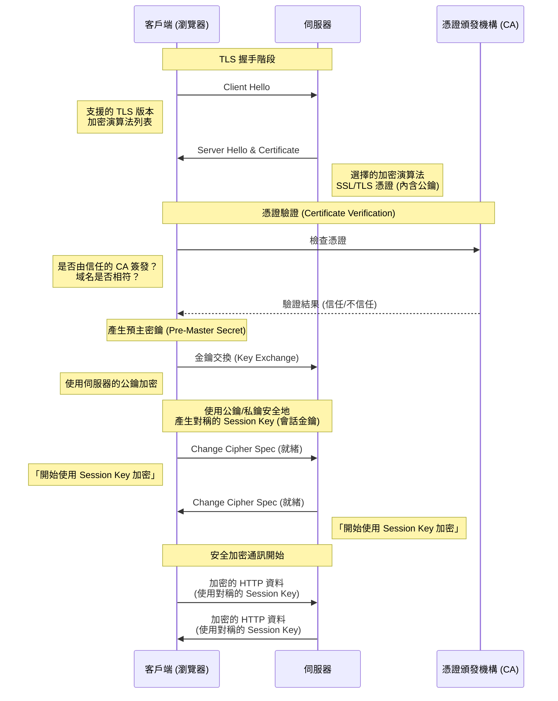
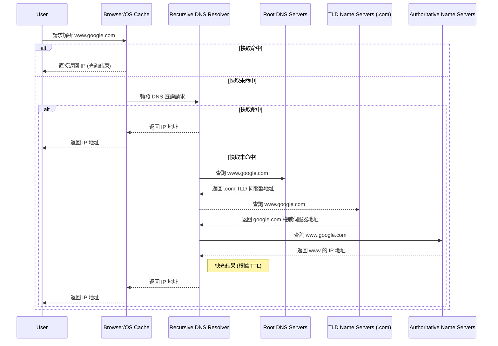
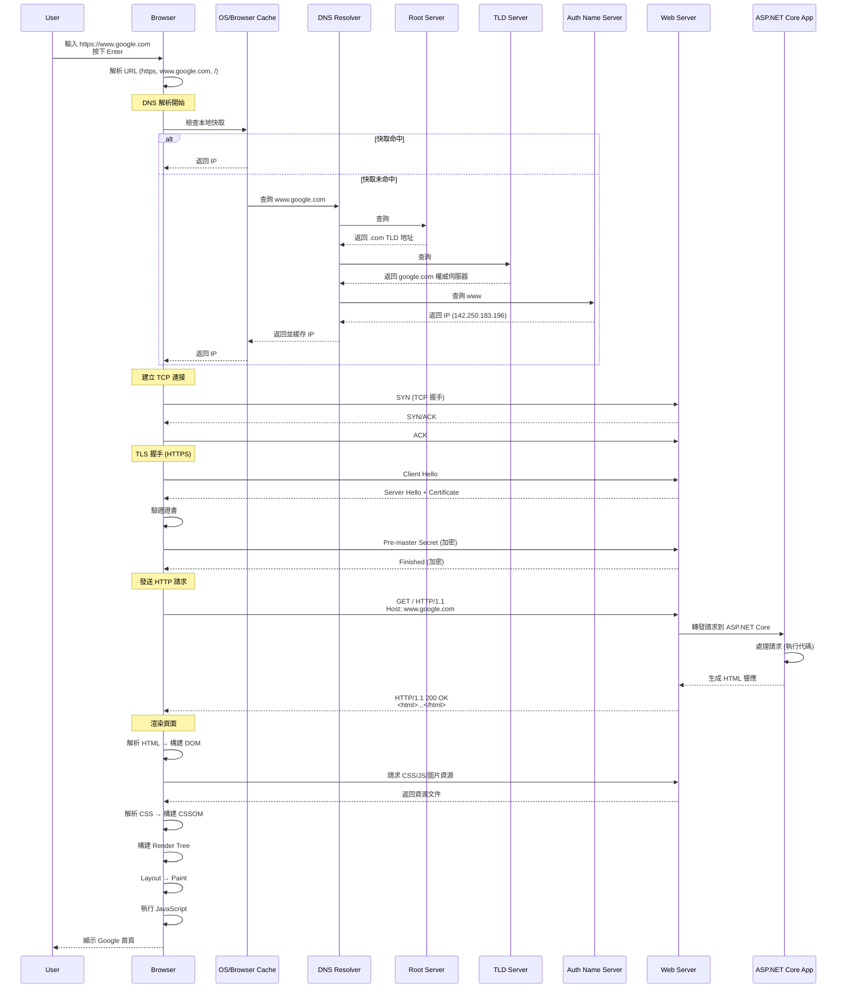

# Chapter 3.1: Web Basics - How the Internet Works

歡迎來到 ASP.NET Core！在我們深入建構 Web 應用程式之前，理解 Web 如何運作的基礎概念至關重要。這份知識將是我們後續所有建構工作的基礎。

## 1. The Client-Server Model

網際網路的核心是基於 **Client-Server Model** (主從式架構) 運作。

-   **Client (客戶端):** 這指的是使用者的設備和網頁瀏覽器（例如您筆電或手機上的 Chrome、Firefox）。Client 的工作是**請求 (request)** 資訊。
-   **Server (伺服器):** 這是一台位於世界某處的強大電腦，它**儲存 (stores)** 著網頁、網站或應用程式。Server 的工作是**監聽 (listen)** 來自客戶端的請求，並以被請求的資訊來**回應 (respond)**。

當您在瀏覽器中輸入一個 URL 時，您其實是在告訴您的 Client 向一個特定的 Server 發送請求。然後，Server 會回傳網站的資料，您的瀏覽器會將這些資料組合起來並顯示出來。


## 2. IP Addresses and DNS

但是，您的 Client 如何知道要與哪個 Server 通話呢？每個連接到網際網路的設備都有一個獨一無二的 **IP Address** (網際網路協定位址)，例如 `172.217.16.14` (這是 Google 的其中一個地址)。

要記住這些數字對人類來說是不可能的。這就是 **DNS (Domain Name System)** 發揮作用的地方。

-   **DNS 是網際網路的電話簿。**
-   當您在瀏覽器中輸入像 `www.google.com` 這樣的域名時，瀏覽器會先向 DNS 伺服器發送一個請求。
-   DNS 伺服器在其「電話簿」中查找 `www.google.com`，並找到對應的 IP Address。
-   然後它將這個 IP Address 回傳給瀏覽器。
-   現在瀏覽器有了正確的 IP Address，它就可以直接向 Google 的 Server 發送請求了。

**比喻：** 您想打電話給您的朋友 John。您不知道他的電話號碼，但您知道他的名字。您在手機的聯絡人（DNS）中查找 "John"，找到他的號碼（IP Address），然後您就可以撥打電話了。

## Summary of the process:

1.  您在瀏覽器（**Client**）中輸入 `www.example.com`。
2.  瀏覽器聯繫 **DNS Server** 以獲取 `www.example.com` 的 IP Address。
3.  DNS Server 回覆對應的 IP Address (例如 `93.184.216.34`)。
4.  瀏覽器向該 IP Address 的伺服器發送一個 HTTP request。
5.  **Server** 處理該請求，並回傳網站的檔案 (HTML, CSS, JavaScript)。
6.  您的瀏覽器接收到這些檔案，並將網頁渲染出來供您查看。

---

# Chapter 3.2: HTTP(S) Protocol

我們已經知道瀏覽器如何透過 DNS 找到伺服器的 IP 位址。現在，我們來學習它們之間溝通所使用的語言：**HTTP**。

## 1. What is HTTP?

HTTP (Hypertext Transfer Protocol) 是一套定義了 Client 和 Server 之間如何交換訊息的規則。它是一種「請求-回應」協議。

-   **Client** 發送一個 **HTTP Request** (請求) 到 Server。
-   **Server** 回傳一個 **HTTP Response** (回應) 給 Client。

這個過程是無狀態的 (Stateless)，意味著每個請求都是獨立的，Server 不會記住前一個請求的任何資訊。

## 2. Structure of an HTTP Request

一個 HTTP 請求主要由以下幾部分組成：

1.  **Method (方法):** 定義了請求的意圖。最常見的有：
    -   `GET`: 請求獲取資源 (例如：載入一個網頁)。
    -   `POST`: 提交資料到伺服器以建立新資源 (例如：送出一個註冊表單)。
    -   `PUT`: 更新伺服器上的現有資源。
    -   `DELETE`: 刪除伺服器上的資源。

2.  **URL (路徑):** 指定了請求的資源在哪裡 (例如 `/products/123`)。

3.  **Headers (標頭):** 包含關於請求的附加資訊，以 `Key: Value` 的形式存在。例如：
    -   `Host: www.example.com`
    -   `Accept: text/html`
    -   `User-Agent: Chrome/128.0...`

4.  **Body (本文):** 包含了要傳送給伺服器的資料，通常在 `POST` 或 `PUT` 請求中使用 (例如：JSON 格式的表單資料)。`GET` 請求通常沒有 Body。

## 3. Structure of an HTTP Response

伺服器回傳的 HTTP 回應包含：

1.  **Status Code (狀態碼):** 一個三位數的數字，表示請求的結果。最常見的有：
    -   `200 OK`: 請求成功。
    -   `404 Not Found`: 請求的資源不存在。
    -   `500 Internal Server Error`: 伺服器內部發生錯誤。
    -   `301 Moved Permanently`: 請求的資源已被永久移動到新的 URL。
    -   `401 Unauthorized`: 請求需要驗證。

2.  **Headers (標頭):** 包含關於回應的附加資訊。例如：
    -   `Content-Type: text/html`
    -   `Content-Length: 1234`
    -   `Date: Sun, 25 Aug 2025...`

3.  **Body (本文):** 包含了伺服器回傳的實際內容 (例如：網頁的 HTML、API 回傳的 JSON 資料)。

## 4. What is HTTPS? (Deep Dive)

您會經常看到 `https://` 而不是 `http://`。那個 **S** 代表 **Secure (安全)**，它為我們的網路通訊提供了三層關鍵保護：

-   **加密 (Encryption):** 防止竊聽。確保在 Client 和 Server 之間交換的資料是加密的，即使被攔截也無法讀取。
-   **資料完整性 (Data Integrity):** 防止竄改。確保資料在傳輸過程中沒有被修改。
-   **身分驗證 (Authentication):** 防止假冒。驗證您正在通訊的網站確實是它所聲稱的那個網站。

這一切的核心是 **TLS (Transport Layer Security)** 協議，以及它的前身 **SSL (Secure Sockets Layer)**。

### SSL vs. TLS

-   **SSL (Secure Sockets Layer):** 是最早用於加密網路通訊的協議。然而，由於發現了多個安全漏洞，所有版本的 SSL 現在都已被視為不安全並被棄用。
-   **TLS (Transport Layer Security):** 是 SSL 的現代後繼者。它更安全、更強大。當我們今天談論 SSL 時，我們通常指的是 TLS，因為 "SSL" 這個詞已經成為了一種通俗的說法。目前，TLS 1.2 和 TLS 1.3 是廣泛使用的標準。

### The TLS Handshake: 如何建立安全連線

當您的瀏覽器嘗試連接一個 `https://` 網站時，它會與伺服器進行一個稱為 **TLS Handshake (交握)** 的過程，以建立一個安全的通道。這個過程可以簡化為以下幾個步驟：

1.  **Client Hello:** 您的瀏覽器向伺服器發送一個 "Hello" 訊息。這個訊息包含了瀏覽器支援的 TLS 版本和加密演算法列表。

2.  **Server Hello & Certificate:**
    -   伺服務器回覆一個 "Hello"，並從瀏覽器提供的列表中選擇一個雙方都支援的加密演算法。
    -   最關鍵的是，伺服器會提供它的 **SSL/TLS Certificate (憑證)**。

3.  **Certificate Verification:**
    -   這個憑證就像是伺服器的數位身分證。它由一個受信任的第三方機構，稱為 **Certificate Authority (CA)** (憑證頒發機構，例如 Let's Encrypt, DigiCert) 所簽發。
    -   憑證中包含了網站的域名、擁有者、以及一個 **Public Key (公鑰)**。
    -   您的瀏覽器會檢查這個憑證是否由一個它所信任的 CA 簽發，以及憑證上的域名是否與您正在訪問的網站域名相符。這一步驟驗證了伺服器的身分，確保您沒有連到一個假冒的網站。

4.  **Key Exchange:**
    -   在驗證伺服器身分後，瀏覽器和伺服器會使用憑證中的公鑰進行一個加密的「金鑰交換」過程。
    -   這個過程的目標是安全地產生一個全新的、對稱的 **Session Key (會話金鑰)**。這個金鑰只對本次通訊有效。

5.  **Secure Communication:**
    -   一旦 TLS Handshake 完成，後續所有的 HTTP 資料都會使用這個剛剛產生的 Session Key 進行加密和解密。
    -   使用對稱金鑰 (Symmetric Key) 加密實際資料是因為它的計算效率遠高於使用非對稱金鑰 (Asymmetric Key，如公鑰/私鑰對)。

總結來說，HTTPS 透過 TLS Handshake，先用較慢但安全的非對稱加密來驗證身分並交換金鑰，然後再用高效的對稱加密來保護後續的實際通訊。

+ Sequence Diagram

---

# Chapter 3.3: How DNS Works (Deep Dive)

我們在前面將 DNS 比喻為「網際網路的電話簿」。現在，我們來深入了解這本電話簿是如何被查詢的，這個過程稱為 **Recursive DNS Query**。

## 1. The DNS Query Path

當您在瀏覽器輸入 `www.google.com` 時，完整的查詢路徑比我們之前提到的要更複雜一些，它涉及一個階層式的查詢鏈：

1.  **Browser/OS Cache:** 您的瀏覽器和作業系統會先檢查自己的快取 (Cache)。如果您最近訪問過這個網站，IP 位址可能就儲存在本機，查詢直接在這裡結束，速度最快。

2.  **Recursive DNS Server (Resolver):**
    -   如果在本機快取中找不到，請求會被發送到 **Recursive DNS Server**。這通常是您的網際網路服務供應商 (ISP) 提供的伺服器。
    -   這個 Resolver 的工作就是，即使它自己不知道答案，它也有責任去問遍整個 DNS 系統，直到找到答案為止。

3.  **Root DNS Servers (`.`):**
    -   Resolver 首先會去問 **Root Server**。全世界只有 13 組根伺服器 (雖然每組都有很多實體鏡像)。
    -   Root Server 不知道 `www.google.com` 的 IP，但它知道誰負責管理 `.com` 這個頂級域名 (Top-Level Domain, TLD)，於是它會告訴 Resolver：「我不知道，但你可以去問 `.com` 的 TLD 伺服器。」

4.  **TLD Name Servers (`.com`):**
    -   Resolver 接著去問 `.com` 的 TLD 伺服器。
    -   TLD 伺服器同樣不知道 `www.google.com` 的 IP，但它儲存了 `google.com` 這個域名的**權威名稱伺服器 (Authoritative Name Server)** 的地址。於是它告訴 Resolver：「我不知道，但你可以去問 `google.com` 自己的 Name Server。」

5.  **Authoritative Name Servers (`google.com`):**
    -   最後，Resolver 去問 `google.com` 的權威名稱伺服器。這個伺服器是由 Google 自己管理的，它對 `google.com` 網域下的所有紀錄都有最終解釋權。
    -   它在自己的紀錄中找到了 `www` 這個子網域對應的 IP 位址，並將這個最終答案回傳給 Resolver。

6.  **Response and Caching:**
    -   Resolver 拿到了 IP 位址，它會先將這個答案快取起來 (快取的時間由一個稱為 TTL (Time-To-Live) 的值決定)，然後再將 IP 位址回傳給您的瀏覽器。
    -   下次再有其他人向這個 Resolver 查詢同一個網址時，它就可以直接從快取中提供答案，不必再重複整個查詢過程。



## 2. Common DNS Record Types

一個域名的 Authoritative Name Server 不只儲存 IP 位址，它還儲存了很多不同類型的紀錄 (Record)，以下是幾種最常見的：

-   **A Record:** 將一個域名指向一個 IPv4 位址 (例如 `172.217.16.14`)。
-   **AAAA Record:** 將一個域名指向一個 IPv6 位址。
-   **CNAME Record (Canonical Name):** 將一個域名作為另一個域名的別名。例如，可以將 `ftp.example.com` 指向 `www.example.com`。
-   **MX Record (Mail Exchange):** 指定負責處理該域名電子郵件的郵件伺服器。

---

# Chapter 3.4: What Happens When You Type a URL?

這個問題是 Web 開發面試中的經典問題，因爲它完美地將我們先前學到的所有概念——DNS, HTTP(S), Client/Server——全部串連起來。讓我們來走一遍完整的旅程。

假設您在瀏覽器中輸入 `https://www.google.com` 並按下 Enter。

1.  **您按下 Enter 鍵:** 瀏覽器從 URL 中解析出協議 (`https`)、域名 (`www.google.com`) 和路徑 (此處為 `/`，即根目錄)。

2.  **DNS Lookup:**
    - 瀏覽器開始進行我們在 `Chapter 3.3` 中深入探討的 DNS 查詢，以找到 `www.google.com` 的 IP 位址。
    - 這個過程會依序檢查：瀏覽器快取 -> 作業系統快取 -> Recursive Resolver -> Root Server -> TLD Server -> Authoritative Name Server。
    - 最終，瀏覽器獲得了 `www.google.com` 的 IP 位址，例如 `142.250.183.196`。

3.  **TCP Handshake:**
    - 在發送 HTTP 請求之前，瀏覽器需要與伺服器建立一個可靠的連線。這通過 **TCP (Transmission Control Protocol)** 的「三向交握 (Three-way Handshake)」來完成。
    - **Client -> Server:** `SYN` (我想與你建立連線)
    - **Server -> Client:** `SYN/ACK` (好的，我同意，你也準備好了嗎？)
    - **Client -> Server:** `ACK` (是的，我準備好了！)
    - 至此，一個穩定的 TCP 連線就建立好了。

4.  **TLS Handshake:**
    - 因為我們使用的是 `https`，所以現在需要在已建立的 TCP 連線之上，進行 `Chapter 3.2` 中描述的 TLS Handshake。
    - 這個過程會驗證伺服器的身份 (透過 SSL/TLS 憑證)，並協商出一個對稱的 Session Key，用於加密後續的所有通訊。

5.  **HTTP Request:**
    - 現在，安全通道已建立，瀏覽器終於可以發送 HTTP 請求了。
    - 請求的內容可能像這樣：
      ```http
      GET / HTTP/1.1
      Host: www.google.com
      User-Agent: Mozilla/5.0 (Windows NT 10.0; Win64; x64) ...
      Accept: text/html,...
      ```

6.  **Server Processing:**
    - Google 的伺服器接收到這個請求。
    - Web Server (例如 Nginx, Apache) 將請求轉發給後端應用程式處理。
    - **這就是 ASP.NET Core 發揮作用的地方！** 您的後端程式碼會執行，根據請求的路徑 (`/`) 和方法 (`GET`) 來決定要做什麼。在這個例子中，它會準備 Google 首頁的 HTML 內容。

7.  **HTTP Response:**
    - 伺服器將準備好的 HTML 內容打包成一個 HTTP 回應，發送回瀏覽器。
    - 回應的內容可能像這樣：
      ```http
      HTTP/1.1 200 OK
      Content-Type: text/html; charset=UTF-8
      Content-Length: 15926
      ...

      <!doctype html><html>...</html>
      ```

8.  **Browser Rendering:**
    - 瀏覽器接收到回應後，開始解析和渲染頁面。
    - **Parse HTML:** 瀏覽器讀取 HTML，並建立一個 **DOM (Document Object Model)** 樹狀結構。
    - **Fetch Additional Resources:** 在解析 HTML 的過程中，如果遇到 `<link rel="stylesheet" href="style.css">` 或 `<script src="main.js">` 或 `` 等標籤，瀏覽器會為這些檔案發起新的 HTTP 請求去下載它們。這些請求可能會重複使用現有的 TCP 連線以提高效率。
    - **Construct Render Tree:** 瀏覽器解析 CSS 並建立 **CSSOM (CSS Object Model)**。然後將 DOM 和 CSSOM 結合起來，建立 **Render Tree**。
    - **Layout & Paint:** 瀏覽器根據 Render Tree 計算出每個元素在螢幕上的確切位置和大小 (Layout)，然後將它們實際繪製到螢幕上 (Paint)。
    - **Execute JavaScript:** JavaScript 程式碼會被執行，它可能會修改 DOM 或 CSSOM，這可能會觸發頁面的重新佈局 (Re-layout) 和重繪 (Re-paint)。

至此，您終於看到了 Google 的首頁！



---

恭喜！您已經完成了 `Web Basics` 的所有學習。這些是理解所有現代 Web 框架 (包括 ASP.NET Core) 的基石。

如果都理解了，請告訴我，我將為您更新 `README.md` 的進度，然後我們就可以正式進入 **ASP.NET Core Fundamentals** 的學習！

---
# Chapter 3.5: ASP.NET Core Fundamentals

## 前言

歡迎來到 ASP.NET Core 的世界！這是微軟推出的高效能、跨平台的開源 Web 框架。在本章節中，我們將深入了解 ASP.NET Core 的核心概念，為後續的 Web 開發打下堅實的基礎。

## 核心概念 (Core Concepts)

### 1. Kestrel Web Server

- **Kestrel** 是 ASP.NET Core 預設的跨平台 Web Server。它速度極快，但通常會搭配反向代理伺服器 (Reverse Proxy Server) 如 IIS、Nginx 或 Apache 一起使用，以獲得更強大的功能 (例如負載平衡、SSL 終止等)。

### 2. 啟動與設定 (Startup & Configuration)

- **`Program.cs`**: 在最新的 .NET 版本中，`Program.cs` 是應用程式的進入點。這裡會設定 Web Host、註冊服務 (Services) 以及定義請求處理管線 (Request Pipeline)。
- **`appsettings.json`**: 這是主要的設定檔，用來存放應用程式的設定，例如資料庫連接字串、API 金鑰等。它可以根據不同的環境 (如 `Development`, `Production`) 有不同的版本。

### 3. 中介軟體 (Middleware)

- **Middleware** 是構成 ASP.NET Core 應用程式請求處理管線 (Request Pipeline) 的元件。每個請求都會依序通過這些中介軟體，每個中介軟體都可以對請求進行處理，然後決定是否要將請求傳遞給下一個中介軟體。
- **順序很重要**: 中介軟體的註冊順序決定了它們在請求處理中的執行順序。例如，`UseAuthentication` (驗證) 必須在 `UseAuthorization` (授權) 之前。
- **常見的中介軟體**:
    - `UseExceptionHandler()`: 例外處理，通常在最外層。
    - `UseHttpsRedirection()`: https 重向導向。
    - `UseRouting()`: 啟用路由功能。
    - `UseEndpoints()`: 定義路由的終點 (Endpoints)，例如 MVC Controllers 或 Minimal API。
    - `UseStaticFiles()`: 讓應用程式可以提供靜態檔案 (如 HTML, CSS, JavaScript)。
    - `UseAuthentication()`: 啟用驗證。
    - `UseAuthorization()`: 啟用授權。

### 4. 依賴注入 (Dependency Injection - DI)

- ASP.NET Core 內建了強大的 DI 容器。DI 是一種設計模式，可以實現「控制反轉」(Inversion of Control - IoC)，讓類別的依賴關係從內部建立改為由外部容器提供。
- **優點**:
    - **鬆散耦合 (Loose Coupling)**: 減少了類別之間的依賴性。
    - **可測試性 (Testability)**: 更容易對元件進行單元測試。
    - **可維護性 (Maintainability)**: 程式碼結構更清晰。
- **生命週期 (Service Lifetimes)**:
    - **Transient**: 每次請求時都會建立一個新的實例。
    - **Scoped**: 在同一個 HTTP 請求中，只會建立一個實例。
    - **Singleton**: 在整個應用程式生命週期中，只會建立一個實例。

### 5. 路由 (Routing)

- **Routing** 負責將传入的 HTTP 請求對應到特定的處理程式 (Handler)，例如 Controller 的 Action 或 Minimal API 的委派。
- **種類**:
    - **約定式路由 (Convention-based Routing)**: 通常用於 MVC，定義一個 URL 範本。
    - **屬性路由 (Attribute-based Routing)**: 將路由直接定義在 Controller 或 Action 上方，更具彈性，是 Web API 的首選。

## 實作練習 (Hands-on Practice)

現在，讓我們建立一個最基本的 ASP.NET Core Web API 專案來體驗一下。

1.  **建立專案**:
    ```bash
    dotnet new webapi -n MyFirstApi -o MyFirstApi
    cd MyFirstApi
    ```

2.  **觀察 `Program.cs`**:
    打開 `Program.cs`，你會看到類似以下的程式碼：

    ```csharp
    var builder = WebApplication.CreateBuilder(args);

    // Add services to the container.
    builder.Services.AddControllers();
    builder.Services.AddEndpointsApiExplorer();
    builder.Services.AddSwaggerGen();

    var app = builder.Build();

    // Configure the HTTP request pipeline.
    if (app.Environment.IsDevelopment())
    {
        app.UseSwagger();
        app.UseSwaggerUI();
    }

    app.UseHttpsRedirection();
    app.UseAuthorization();
    app.MapControllers();

    app.Run();
    ```
    - `WebApplication.CreateBuilder(args)`: 設定應用程式的基礎。
    - `builder.Services...`: 這是 DI 容器，用來註冊服務。
    - `app.Build()`: 建立 Web 應用程式。
    - `app.Use...`: 這些是設定中介軟體。
    - `app.Run()`: 啟動應用程式。

3.  **執行專案**:
    ```bash
    dotnet run
    ```

4.  **測試 API**:
    - 打開瀏覽器，前往 `https://localhost:<port>/swagger` (port 號碼可以在 `Properties/launchSettings.json` 中找到)。
    - 你會看到 Swagger UI，這是一個自動產生的 API 文件頁面。
    - 嘗試執行預設的 `WeatherForecast` API。

## 結語

你已經完成了 ASP.NET Core 基礎的初步探索！了解 Kestrel、中介軟體、DI 和路由是掌握此框架的關鍵。

下一步，我們將深入探討 **ASP.NET MVC**，這是一個建立在 ASP.NET Core 之上的強大模式，用於開發 Web 應用程式。

---

# Chapter 3.6: ASP.NET MVC

## 前言

在了解了 ASP.NET Core 的基礎之後，我們來學習一個建立在其之上的重要開發模式：**Model-View-Controller (MVC)**。MVC 是一種廣泛應用於 Web 開發的設計模式，它將應用程式的關注點分離，使程式碼更有組織、更易於維護。

## MVC 模式的核心元件

MVC 將應用程式分為三個主要部分：

1.  **Model (模型)**:
    - **職責**: 代表應用程式的資料和業務邏輯。它負責處理資料的存取、驗證和操作。
    - **特點**: Model 不關心資料如何被呈現，它只專注於資料本身。在 ASP.NET Core 中，這通常是簡單的 C# 類別 (POCOs - Plain Old CLR Objects)。

2.  **View (視圖)**:
    - **職責**: 負責呈現資料給使用者，也就是使用者介面 (UI)。它從 Model 中取得資料並將其顯示出來。
    - **特點**: View 只負責顯示，不包含任何業務邏輯。在 ASP.NET Core 中，View 通常是使用 Razor 語法編寫的 `.cshtml` 檔案。

3.  **Controller (控制器)**:
    - **職責**: 作為 Model 和 View 之間的橋樑。它接收使用者的輸入 (HTTP 請求)，調用 Model 處理業務邏輯，然後選擇一個 View 來呈現結果。
    - **特點**: Controller 是整個請求處理流程的大腦，它協調 Model 和 View 的工作。

### 請求生命週期 (Request Lifecycle in MVC)

1.  請求進入 ASP.NET Core 的路由系統。
2.  路由系統根據 URL 將請求轉發給指定的 Controller 中的特定 Action 方法。
3.  Action 方法處理請求。它可能會：
    - 與 Model 互動，讀取或更新資料。
    - 將資料打包傳遞給 View。
4.  Action 方法選擇並回傳一個 ViewResult，指定要使用哪個 View。
5.  View 引擎 (通常是 Razor) 轉譯 View，將 Model 的資料填入 HTML 範本中。
6.  最終生成的 HTML 作為 HTTP 回應傳回給瀏覽器。

## 實作練習 (Hands-on Practice)

現在，讓我們建立一個 ASP.NET Core MVC 專案。

1.  **建立專案**:
    (請確保你在 `03-Asp-Dotnet-Core` 目錄下執行)
    ```bash
    dotnet new mvc -n MyMvcApp -o 3.6-Mvc/MyMvcApp
    cd 3.6-Mvc/MyMvcApp
    ```

2.  **觀察專案結構**:
    - **`Controllers/`**: 存放 Controller 類別。你會看到一個 `HomeController.cs`。
    - **`Models/`**: 存放 Model 類別。你會看到一個 `ErrorViewModel.cs`。
    - **`Views/`**: 存放 View 檔案 (`.cshtml`)。
        - **`Home/`**: 對應 `HomeController` 的 View。
        - **`Shared/`**: 可以被多個 View 共用的版面配置檔案 (`_Layout.cshtml`)。
    - **`wwwroot/`**: 存放靜態檔案，如 CSS, JavaScript, 圖片。

3.  **分析程式碼**:
    - **`Controllers/HomeController.cs`**:
      ```csharp
      public class HomeController : Controller
      {
          public IActionResult Index()
          {
              return View(); // 這會回傳 Views/Home/Index.cshtml
          }
      }
      ```
    - **`Views/Home/Index.cshtml`**:
      這是一個 Razor 檔案，混合了 HTML 和 C# 程式碼，用來產生最終的網頁。

4.  **執行專案**:
    ```bash
    dotnet run
    ```
    打開瀏覽器，前往 `https://localhost:<port>`，你將會看到由 `HomeController` 的 `Index` Action 和 `Index.cshtml` View 所呈現的預設首頁。

## 結語

你已經成功建立了第一個 ASP.NET Core MVC 應用程式！MVC 模式透過分離關注點，為開發複雜的 Web 應用程式提供了一個清晰、有條理的結構。

下一步，我們將探討 **Filters & Attributes**，這是在 MVC Action 執行前後添加額外邏輯的強大工具。

---

# Chapter 3.7: Filters & Attributes

## 前言

在 ASP.NET Core MVC 中，我們經常需要在 Action 方法執行之前或之後執行一些共通的邏輯，例如權限檢查、日誌記錄、異常處理等。**Filters (篩選器)** 提供了一個優雅的解決方案，讓我們可以將這些橫切關注點 (Cross-cutting Concerns) 從 Action 方法中分離出來，保持 Controller 的簡潔。

Filters 通常是透過 **Attributes (屬性)** 應用到 Controller 或 Action 上的。

## Filters 的類型與執行順序

ASP.NET Core 提供了五種類型的 Filters，它們在請求處理管線中有固定的執行順序：

1.  **Authorization Filters (授權篩選器)**
    - **用途**: 用於判斷使用者是否有權限執行某個請求。如果授權失敗，它會直接中斷後續的管線。
    - **範例**: `[Authorize]`

2.  **Resource Filters (資源篩選器)**
    - **用途**: 在模型綁定 (Model Binding) 之前執行。適合用來實現快取或處理特定內容類型的請求。
    - **介面**: `IResourceFilter`, `IAsyncResourceFilter`

3.  **Action Filters (動作篩選器)**
    - **用途**: 在 Action 方法執行 *前後* 執行程式碼。可以用來修改傳入 Action 的參數或傳出的結果。這是最常用的一種 Filter。
    - **介面**: `IActionFilter`, `IAsyncActionFilter`

4.  **Exception Filters (異常篩選器)**
    - **用途**: 當 Controller 或 Action 中發生未處理的異常時，用來進行全域的異常處理。
    - **介面**: `IExceptionFilter`, `IAsyncExceptionFilter`

5.  **Result Filters (結果篩選器)**
    - **用途**: 在 Action 結果 (例如 View 或 JSON) 執行 *前後* 執行程式碼。可以用來修改 HTTP 回應，例如加上特定的 Header。
    - **介面**: `IResultFilter`, `IAsyncResultFilter`

**執行順序圖:**
`Request -> Authorization -> Resource -> Model Binding -> Action -> Result -> Response`
(Exception Filters 只在發生錯誤時觸發)

## 實作練習 (Hands-on Practice)

讓我們來建立一個自訂的 Action Filter，用來記錄每個 Action 的執行時間。

1.  **沿用上個專案**:
    請繼續使用我們在 `3.6` 中建立的 `MyMvcApp` 專案。

2.  **建立 Filter**:
    在專案根目錄下建立一個新的資料夾 `Filters`。然後在其中新增一個 `LogActionTimeFilter.cs` 檔案：

    ```csharp
    using System.Diagnostics;
    using Microsoft.AspNetCore.Mvc.Filters;

    namespace MyMvcApp.Filters
    {
        public class LogActionTimeFilter : IActionFilter
        {
            private Stopwatch _stopwatch;

            // Action 執行前
            public void OnActionExecuting(ActionExecutingContext context)
            {
                _stopwatch = Stopwatch.StartNew();
            }

            // Action 執行後
            public void OnActionExecuted(ActionExecutedContext context)
            {
                _stopwatch.Stop();
                var elapsedTime = _stopwatch.ElapsedMilliseconds;
                var controllerName = context.Controller.GetType().Name;
                var actionName = context.ActionDescriptor.DisplayName;

                // 為了方便觀察，我們直接寫入 Console
                // 實務上應該使用 ILogger
                Console.WriteLine($"[{controllerName}] Action '{actionName}' executed in {elapsedTime}ms.");
            }
        }
    }
    ```

3.  **註冊 Filter**:
    有兩種方式可以套用 Filter：

    **a) 作為 Attribute 套用 (最常見)**
    修改 `Controllers/HomeController.cs`，將我們的 Filter 作為 Attribute 加到 `Index` Action 上：

    ```csharp
    using Microsoft.AspNetCore.Mvc;
    using MyMvcApp.Filters; // 記得 using

    namespace MyMvcApp.Controllers
    {
        public class HomeController : Controller
        {
            [ServiceFilter(typeof(LogActionTimeFilter))] // 使用 ServiceFilter 來啟用 DI
            public IActionResult Index()
            {
                return View();
            }
            // ... 其他 Action
        }
    }
    ```
    *為了讓 `[ServiceFilter]` 正常運作，我們還需要在 `Program.cs` 中註冊這個 Filter。*

    打開 `Program.cs`，在 `builder.Services.AddControllersWithViews();` 下方加入：
    ```csharp
    builder.Services.AddScoped<LogActionTimeFilter>();
    ```

    **b) 全域註冊 (Global Registration)**
    如果你希望這個 Filter 對所有 Action 都生效，可以在 `Program.cs` 中這樣註冊：
    ```csharp
    builder.Services.AddControllersWithViews(options =>
    {
        options.Filters.Add<LogActionTimeFilter>();
    });
    ```
    (如果使用全域註冊，就不需要在 Controller 上加 Attribute 了)

4.  **執行與觀察**:
    - 選擇其中一種方式註冊 Filter。
    - 執行專案 `dotnet run`。
    - 訪問首頁。
    - 查看你的終端機 (Console)，你應該會看到類似以下的輸出：
      `[HomeController] Action 'MyMvcApp.Controllers.HomeController.Index (MyMvcApp)' executed in XXms.`

## 結語

Filters 和 Attributes 是 ASP.NET Core MVC 中非常強大的功能，它們有助於我們撰寫更乾淨、更模組化的程式碼，並有效地處理橫切關注點。

下一步，我們將探討 **Middleware**，這是比 Filters 更低階、但同樣重要的請求處理元件。

---

# Chapter 3.8: Middleware

## 前言

我們已經在前面的章節中多次提到 **Middleware (中介軟體)**。現在，讓我們來深入了解這個 ASP.NET Core 應用程式的骨幹。Middleware 是處理 HTTP 請求和回應的軟體元件，它們被組合成一個「管線」(Pipeline) 來處理每一個傳入的請求。

## Middleware 與 Request Pipeline

想像一下一個工廠的生產線。一個產品（HTTP 請求）從生產線的一端進入，經過一系列的處理站（Middleware），最後在另一端產出成品（HTTP 回應）。

-   **Request Pipeline**: 這就是由一系列 Middleware 組成的處理管線。
-   **順序至關重要**: Middleware 的註冊順序決定了它們的執行順序。請求會按照註冊順序依次通過每個 Middleware，然後回應會以相反的順序依次通過它們。

這帶來了極大的彈性。每個 Middleware 都可以：
1.  **決定是否將請求傳遞給管線中的下一個 Middleware。**
2.  **在呼叫下一個 Middleware 之前和之後執行工作。**

例如，一個典型的請求流程可能是：
`Request -> Exception Handling -> Static Files -> Routing -> Authentication -> Authorization -> Endpoint (Your Action) -> Response`

回應會以相反的順序流出：
`Response <- Exception Handling <- Static Files <- Routing <- Authentication <- Authorization <- Endpoint (Your Action)`

### `Use` vs. `Run`

在 `Program.cs` 中設定管線時，你會看到兩種主要的方法：

-   **`app.Use(...)`**:
    - 用於鏈接管線中的 Middleware。
    - 它會處理請求，然後**可以**呼叫 `next()` 將請求傳遞給下一個 Middleware。
    - 這是最常見的方式。

-   **`app.Run(...)`**:
    - 用於終止管線。它被稱為 **Terminal Middleware (終端中介軟體)**。
    - 它會處理請求，但**不會**呼叫下一個 Middleware。
    - 一旦請求到達 `Run` Middleware，管線就會開始「返回」。
    - `app.MapControllers()` 或 Minimal API 的 `MapGet()` 內部其實就隱含了終端中介軟體。

## Middleware vs. Filters

這是一個常見的混淆點。它們都可以處理橫切關注點，但層級和使用場景不同。

| 特性 | Middleware | Filters |
| :--- | :--- | :--- |
| **層級** | 較低階，處理 HTTP `HttpContext` | 較高階，屬於 MVC/API 框架的一部分 |
| **範圍** | 應用程式全域 | 可套用於全域、Controller 或 Action |
| **上下文** | 只能存取 `HttpContext` | 可以存取更豐富的 MVC 上下文，如 `ActionArguments`, `ActionResult` |
| **使用場景** | 靜態檔案、路由、驗證、CORS、日誌 | 驗證特定 Action、修改模型綁定、處理 Action 層級的異常 |

**簡單來說：如果一個功能不依賴於 MVC 的特定概念 (如 Action 或 Model)，那麼它更適合做成 Middleware。**

## 實作練習 (Hands-on Practice)

讓我們來建立一個簡單的自訂 Middleware，它會在 HTTP 回應的 Header 中加入一個自訂的標頭。

1.  **建立專案**:
    (請確保你在 `03-Asp-Dotnet-Core` 目錄下執行)
    ```bash
    dotnet new webapi -n MyMiddlewareApp -o 3.8-Middleware/MyMiddlewareApp
    cd 3.8-Middleware/MyMiddlewareApp
    ```

2.  **建立 Middleware 類別**:
    在專案根目錄下建立一個 `CustomMiddleware.cs` 檔案。

    ```csharp
    public class CustomHeaderMiddleware
    {
        private readonly RequestDelegate _next;

        public CustomHeaderMiddleware(RequestDelegate next)
        {
            _next = next;
        }

        public async Task InvokeAsync(HttpContext context)
        {
            // 在將回應傳送給客戶端之前，新增一個 Header
            context.Response.OnStarting(() => {
                context.Response.Headers.Append("X-Custom-Header", "Hello from custom middleware!");
                return Task.CompletedTask;
            });

            // 呼叫管線中的下一個 Middleware
            await _next(context);
        }
    }
    ```
    - `RequestDelegate _next`: 代表管線中的下一個 Middleware。
    - `InvokeAsync`: Middleware 的主要處理方法。我們在這裡使用 `Response.OnStarting` 來確保 Header 是在回應即將開始寫入時才被加入。

3.  **註冊 Middleware**:
    打開 `Program.cs`，在 `var app = builder.Build();` 之後，`app.UseHttpsRedirection();` 之前，加入我們的自訂 Middleware。

    ```csharp
    // ...
    var app = builder.Build();

    // Configure the HTTP request pipeline.
    if (app.Environment.IsDevelopment())
    {
        app.UseSwagger();
        app.UseSwaggerUI();
    }

    // 在這裡加入我們的自訂 Middleware
    app.UseMiddleware<CustomHeaderMiddleware>();

    app.UseHttpsRedirection();
    // ...
    ```

4.  **執行與觀察**:
    - 執行專案 `dotnet run`。
    - 打開瀏覽器，並打開開發者工具 (F12)，切換到「網路 (Network)」分頁。
    - 前往 `https://localhost:<port>/swagger` 或任何 API 端點。
    - 點擊該請求，查看「回應標頭 (Response Headers)」。你應該會看到我們自訂的 `X-Custom-Header`。

## 結語

恭喜！你已經學會了如何建立和使用 Middleware。Middleware 是 ASP.NET Core 的核心，理解它對於建構高效能、模組化的 Web 應用程式至關重要。

現在你已經掌握了 ASP.NET Core 的所有基礎知識，從 Web 運作原理到 MVC 和 Middleware。我們已經準備好進入下一個階段，開始建構更真實、更複雜的應用程式了！

---

# Chapter 3.9: Server

## 前言

我們已經知道 ASP.NET Core 應用程式是由 Kestrel 這個 Web Server 執行的。然而，在實際的生產環境中，部署和執行應用程式的方式遠不止 `dotnet run` 這麼簡單。本章節將深入探討 ASP.NET Core 的心臟——伺服器 (Server)，特別是 Kestrel，以及它如何與反向代理伺服器協同工作。

## Kestrel: 跨平台的高效能伺服器

**Kestrel** 是 ASP.NET Core 內建且預設的 Web Server。它是一個事件驅動、非同步 I/O 的跨平台伺服器，也是讓 ASP.NET Core 能夠實現頂級效能的關鍵功臣。

**主要特點:**
- **高效能**: Kestrel 是 .NET 生態系中速度最快的 Web Server 之一。
- **跨平台**: 可以在 Windows, macOS 和 Linux 上執行。
- **輕量級**: 核心功能集中，不包含傳統 Web Server (如 IIS) 的所有管理功能。
- **安全**: 預設設定已針對常見的 Web 攻擊進行了強化。

雖然 Kestrel 本身就可以作為一個面向網際網路的邊緣伺服器 (Edge Server)，但在生產環境中，微軟強烈建議將 Kestrel 與**反向代理伺服器 (Reverse Proxy Server)** 結合使用。

## 反向代理的角色

反向代理伺服器（如 IIS, Nginx, Apache）位於網際網路和您的 Kestrel 伺服器之間。它接收來自客戶端的 HTTP 請求，然後將這些請求轉發到後端的 Kestrel 伺服器。

**為什麼需要反向代理？**

因為專業的反向代理伺服器提供了許多 Kestrel 本身不具備或不專精的強大功能：

1.  **負載平衡 (Load Balancing)**: 將傳入的流量分配到多個後端 Kestrel 伺服器實例，提高應用程式的可用性和延展性。
2.  **SSL/TLS 終止 (SSL/TLS Termination)**: 由反向代理處理 HTTPS 的加解密工作。這樣，後端的 Kestrel 伺服器只需處理未加密的 HTTP 請求，從而減輕負擔。
3.  **安全性與強化 (Security & Hardening)**: 反向代理可以設定更複雜的防火牆規則，過濾惡意請求，並隱藏後端伺服器的真實架構。
4.  **靜態內容服務 (Static Content Caching)**: 由反向代理直接提供靜態檔案（如 CSS, JS, 圖片），或對其進行快取，減輕 Kestrel 的壓力。
5.  **多應用程式共存**: 可以在同一個 IP 位址和通訊埠上，根據主機名稱或路徑將請求轉發到不同的後端應用程式。

### 常見的部署模型

```mermaid
graph TD
    subgraph Internet
        Client[用戶端瀏覽器]
    end

    subgraph "DMZ (非軍事區)"
        Proxy[反向代理伺服器<br/>(IIS, Nginx, Apache)]
    end

    subgraph "內部網路"
        Kestrel1[ASP.NET Core App on Kestrel]
        Kestrel2[ASP.NET Core App on Kestrel]
        Kestrel3[...]
    end

    Client --> Proxy
    Proxy --> Kestrel1
    Proxy --> Kestrel2
    Proxy --> Kestrel3
```

在這個模型中，只有反向代理伺服器暴露在公網上。Kestrel 應用程式則安全地執行在內部網路中，只接收來自受信任的反向代理的請求。

## 結語

理解 Kestrel 與反向代理的協作關係是成功部署和擴展 ASP.NET Core 應用程式的關鍵。Kestrel 提供了無與倫比的執行效能，而反向代理則補足了生產環境所需的負載平衡、安全性和管理彈性。這種組合讓 ASP.NET Core 成為一個既高效能又極具彈性的 Web 框架。

---

# Chapter 3.10: Host

## 前言

如果說 Middleware 是 ASP.NET Core 應用程式的骨幹，那麼 **Host (主機)** 就是乘載這一切的軀幹與大腦。Host 是應用程式的執行環境，它負責啟動、設定和管理應用程式的整個生命週期，並將所有零散的服務（如 DI、日誌、設定）整合在一起。

## 什麼是 Host？

在 ASP.NET Core 中，Host (`IHost`) 是一個物件，它封裝了應用程式的所有資源。當您的應用程式啟動時，第一件事就是建立和設定這個 Host。

Host 主要負責管理以下幾個核心元件：

1.  **依賴注入 (Dependency Injection)**: Host 內部包含一個 DI 容器 (`IServiceProvider`)，負責建立和管理應用程式中所有服務的生命週期。
2.  **日誌 (Logging)**: Host 設定了日誌系統，讓您可以在應用程式的任何地方寫入日誌。
3.  **設定 (Configuration)**: Host 載入了應用程式的設定（來自 `appsettings.json`、環境變數等），並將它們提供給應用程式的其他部分使用。
4.  **託管服務 (Hosted Services)**: Host 管理著所有背景服務 (`IHostedService`) 的生命週期，確保它們在應用程式啟動時啟動，在應用程式關閉時正常停止。
5.  **應用程式生命週期 (Application Lifetime)**: Host 提供了一個機制 (`IHostApplicationLifetime`)，讓您可以掛鉤到應用程式的啟動和關閉事件。

## 通用主機 (Generic Host)

從 ASP.NET Core 3.0 開始，框架引入了**通用主機 (Generic Host)** 的概念。這意味著不僅是 Web 應用程式，就連主控台應用程式、背景服務 (Worker Services) 等非 Web 應用程式，都可以使用同一套 Host 基礎架構來獲得 DI、日誌和設定等強大功能。這大大統一了 .NET 的應用程式模型。

## WebApplication 和 WebApplicationBuilder

在最新的 .NET 6+ 版本中，為了簡化 Web 應用的啟動流程，引入了 `WebApplication` 和 `WebApplicationBuilder`。這兩個類別是對通用主機的進一步封裝，專為 Web 應用程式量身打造。

讓我們再次檢視 `Program.cs` 中的程式碼：

```csharp
// 1. 建立 WebApplicationBuilder
var builder = WebApplication.CreateBuilder(args);

// 2. 註冊服務到 DI 容器
builder.Services.AddControllers();
// ...

// 3. 從 Builder 建立 WebApplication
var app = builder.Build();

// 4. 設定 Middleware 管線
app.UseHttpsRedirection();
// ...

// 5. 執行應用程式
app.Run();
```

這個看似簡單的流程，背後其實就完成了 Host 的所有設定工作：

-   **`WebApplication.CreateBuilder(args)`**:
    -   這一步驟會建立一個 `IHostBuilder` 和 `IWebHostBuilder` 的實例。
    -   它會設定 Kestrel 作為預設伺服器。
    -   它會載入 `appsettings.json`、環境變數、使用者密碼等作為設定來源。
    -   它會設定日誌系統，將日誌輸出到 Console 和 Debug 視窗。
    -   `builder.Services` 屬性就是應用程式的 DI 容器 (`IServiceCollection`)。
    -   `builder.Configuration` 屬性就是載入好的設定物件。

-   **`builder.Build()`**:
    -   這個方法會根據 `builder` 中所有的設定，建立 Host 的實例。
    -   在 Web 應用中，這個 Host 就是 `WebApplication` 物件 `app`。`app` 同時實現了 `IHost` (用於管理生命週期) 和 `IApplicationBuilder` (用於設定 Middleware)。

-   **`app.Run()`**:
    -   這個方法會啟動 Host。
    -   Host 會啟動 Kestrel 伺服器，並開始監聽傳入的 HTTP 請求。
    -   它會阻塞主執行緒，直到應用程式被關閉 (例如透過 `Ctrl+C`)。

## 結語

Host 是 ASP.NET Core 應用程式的基礎。它像一個精密的協調者，將設定、日誌、依賴注入和應用程式生命週期管理等核心功能無縫地整合在一起。透過 `WebApplicationBuilder`，現代的 ASP.NET Core 讓我們能夠以極其簡潔的程式碼來設定和啟動這個強大的執行環境，使開發者可以更專注於應用程式本身的業務邏輯。